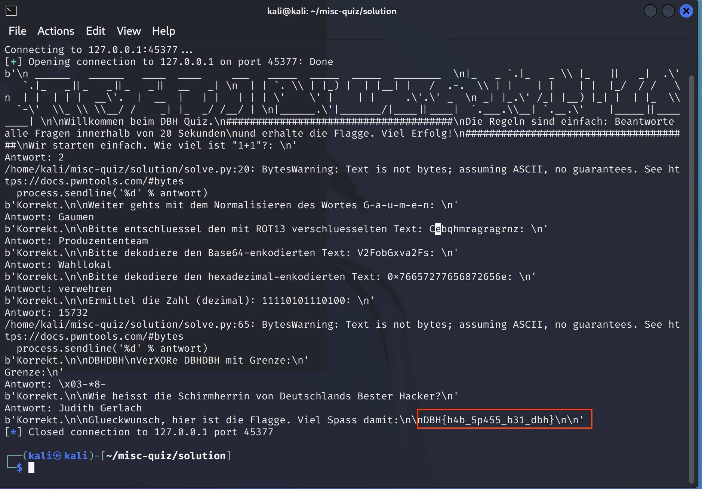

# misc-quiz

## Lösungsvorschlag
Verbindet man sich erfolgreich mit dem Socket, wird ein Banner mit den Spielregeln des Quiz angezeigt. Innerhalb von 20 Sekunden müssen alle Fragen korrekt beantwortet werden.

```text
$ nc 20.126.227.19 45377

 ______   ______   ____  ____     ___   _____  _____  _____  ________  
|_   _ `.|_   _ \ |_   ||   _|  .'   `.|_   _||_   _||_   _||  __   _| 
  | | `. \ | |_) |  | |__| |   /  .-.  \ | |    | |    | |  |_/  / /   
  | |  | | |  __'.  |  __  |   | |   | | | '    ' |    | |     .'.' _  
 _| |_.' /_| |__) |_| |  | |_  \  `-'  \_ \ \__/ /    _| |_  _/ /__/ | 
|______.'|_______/|____||____|  `.___.\__| `.__.'    |_____||________| 

Willkommen beim DBH Quiz.
######################################
Die Regeln sind einfach: Beantworte alle Fragen innerhalb von 20 Sekunden
und erhalte die Flagge. Viel Erfolg!
######################################
Wir starten einfach. Wie viel ist "4+4"?: 
```

Die Anfangsfragen des Quiz erscheinen noch relativ simpel. Jedoch spätestens bei Fragen zum Entschlüsseln von mit ROT13 verschlüsselten Wörtern wird klar, dass das Beantworten automatisiert werden muss, um die Zeitvorgabe von 20 Sekunden einzuhalten.

Im Folgenden sind die Fragen eines Durchgangs (teilweise werden die Fragen zufällig zusammengesetzt) und deren Antwort aufgelistet.
Eine automatisierte Lösung erfolgte mit `solve.py`.

Frage 1:
```text
Wir starten einfach. Wieviel ist "4+2"?:
Antwort: 6
```
Frage 2:
```text
Weiter gehts mit dem Normalisieren des Wortes M-o-n-t-a-g:
Antwort: Montag
```
Frage 3:
```text
Bitte entschluessel den mit ROT13 verschluesselten Text: Tyvravpxr:
Antwort: Glienicke
```
Frage 4:
```text
Bitte dekodiere den Base64-enkodierten Text: YXBvdGhla2VucGZsaWNodGln:
Antwort: apothekenpflichtig
```
Frage 5:
```text
Bitte dekodiere den hexadezimal-enkodierten Text: 0x4175666675656872756e67736461756572:
Antwort: Auffuehrungsdauer
```

Frage 6:
```text
Ermittel die Zahl (dezimal): 111100111000001:
Antwort: 31169
```
Frage 7:
```text
VerXORe DBHDBHDBHDBHDBH mit Produzententeam:
Antwort: \x14' 72!,<!,<!#%
```
Frage 8:
```text
Wie heisst die Schirmherrin von Deutschlands Bester Hacker?
Antwort: Judith Gerlach
```
Ausgabe der Flagge:
```text
Glueckwunsch, hier ist die Flagge. Viel Spass damit:

DBH{h4b_5p455_b31_dbh}
```



## Beseitigung der Schwachstelle
Da diese Aufgabe aus dem Bereich miscellaneous stammt, gibt es hier keinen Vorschlag zur Beseitigung der Schwachstelle.

## Flagge
```
DBH{h4b_5p455_b31_dbh}
```