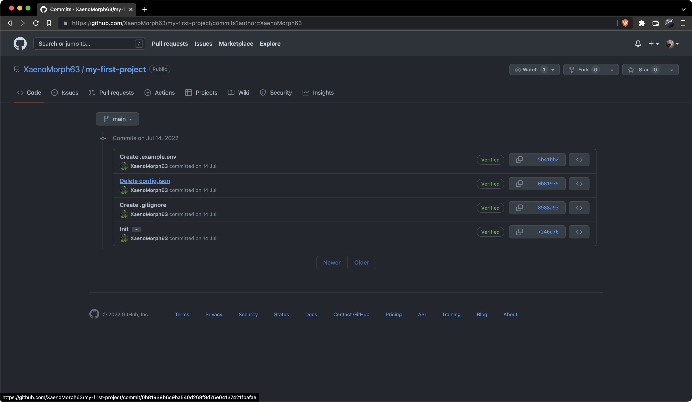
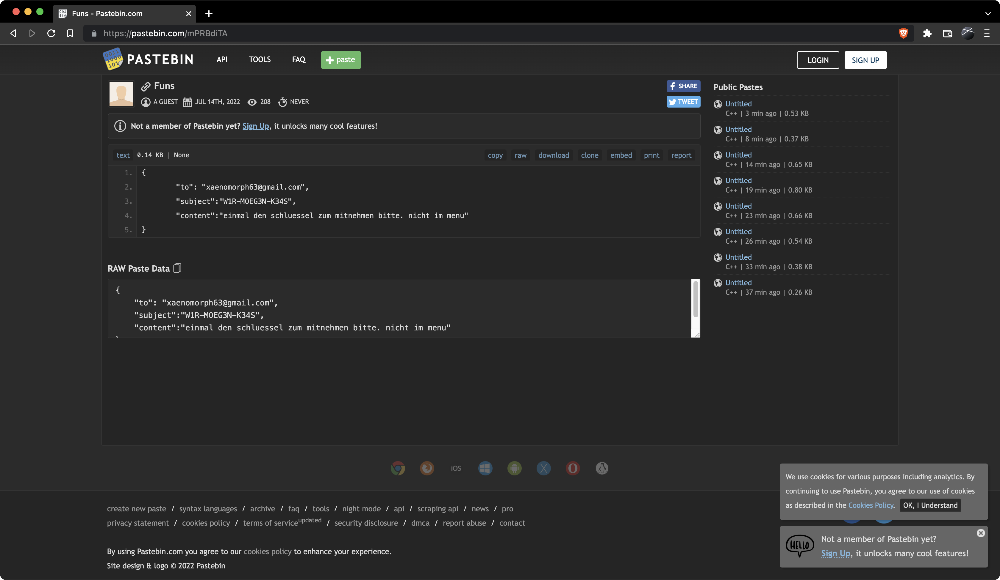

# osint-simpleosint

## Lösungsvorschlag

Mittels einer Suche der Discord-User kann man dort den User `XaenoMorph63` finden:
Discord: `XaenoMorph63#7057` \
ID: `996682832766308393` \
[Discord Invite](https://discord.gg/emdHhEqx6S) \
Über den Discord Account erhält man den Hinweis für die Plattform [Twitter](https://twitter.com/XaenoMorph63). Der Account selbst hat jedoch keine interessanten Tweets erstellt.


Mithilfe der [Wayback Machine](https://archive.org/web/) kann ein alter [Tweet](https://web.archive.org/web/20220801000000*/https://twitter.com/XaenoMorph63) über den ersten Fork des Users gefunden werden.


Durch diese Information kann der [GitHub Account](https://github.com/XaenoMorph63) des Users ermittelt werden.
Die Prüfung der Repositories des Users auf GitHub ergibt, dass das Projekt `my-first-project` eine E-Mail versendet.


Durch Prüfung der Commits `7246d76` lässt sich die Datei `pastebin.json` finden:
```json
{ 
    "to": "xaenomorph63@gmail.com", 
    "subject": "W1R-MOEG3N-K34S", 
    "content": "einmal den schluessel zum mitnehmen bitte. nicht im menu" 
}
```
Anschließend muss eine E-Mail, wie im Json beschrieben an die E-Mail-Adresse `xaenomorph63@gmail.com` abgesendet werden.
Die Antwort auf die E-Mail ist ein Base64 kodierter Schlüssel, welcher die finale Flag beinhaltet.

**Hinweis:** Das Senden der E-Mail und der Erhalt der Flag sind nicht mehr möglich.

Alternativ kann die benötigte `pastebin.json` auch auf [Pastebin](https://pastebin.com/raw/mPRBdiTA) direkt gefunden werden:



## Beseitigung der Schwachstelle

Da diese Aufgabe aus dem Bereich OSINT stammt, gibt es hier keinen Vorschlag zur Beseitigung der Schwachstelle.

## Flag
```
DBH{d5287d25-b421-4240-aea8-b8aabbc9deba}
```
