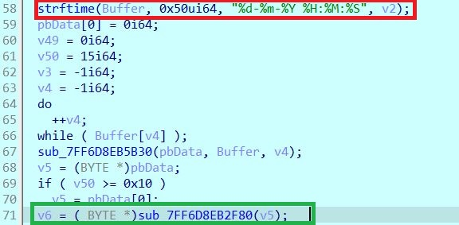
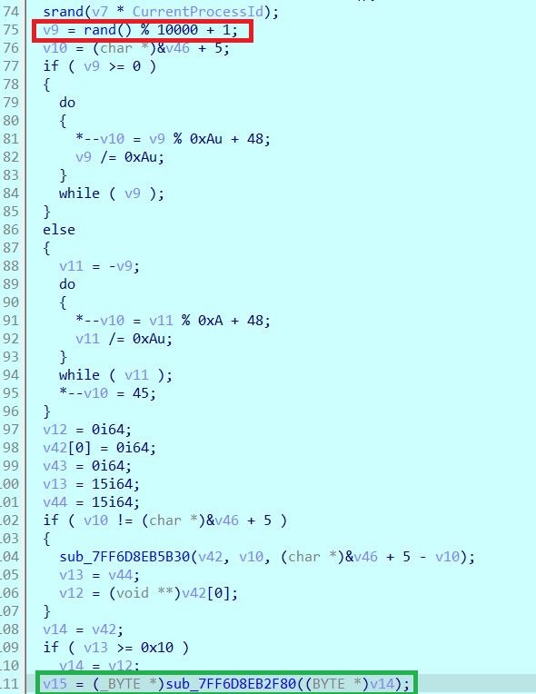
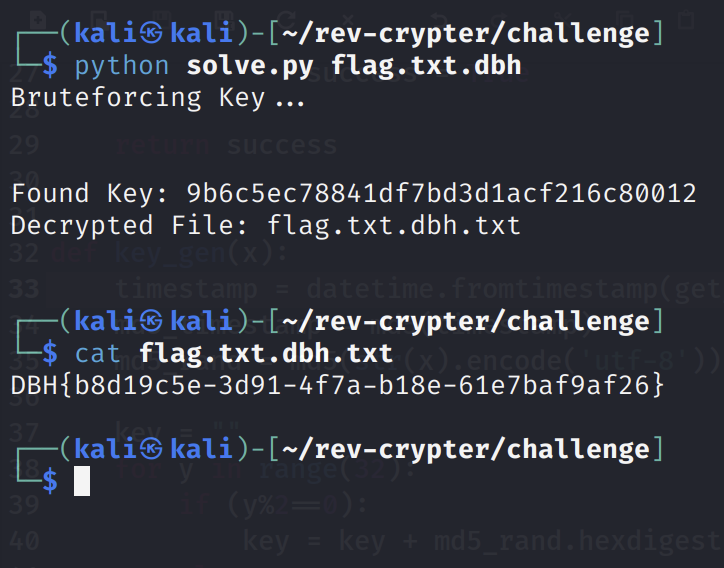

# rev-crypter

## Aufgabe

Es soll eine Datei entschlüsselt werden.

### Gegeben

Das Programm `dbh_crypter.exe` und eine Datei `flag.txt.dbh.7z`, welche die Datei `flag.txt.dbh` enthält. Diese Datei soll entschlüsselt werden.

### Lösungsvorschlag

Soll die Datei `test.txt` verschlüsselt werden und anschließend den Namen `test.txt.xxx` haben, muss das Programm wie folgt gestartet werden:

```
.\dbh_crypter.exe test.txt test.txt.xxx
```

Folgende Ausgabe wird zurückgegeben:

```
Timestamp:      14-08-2022 23:27:52
Key:            f90bf85b281874852370b0312bfd9caa

Encryption successfully completed! Save your key for decryption!
```

Nun kann das Programm mit einem Decompiler wie  [Ghidra](https://ghidra-sre.org/) oder [IDA](https://hex-rays.com/) untersucht werden. Wird das Tool zum Verschlüsseln im Debugger gestartet, ist folgender Code zu sehen:



Wird der Inhalt der Variablen beim Debuggen beobachtet, ist an der grün umrandeten Stelle ein Hashwert (MD5) zu finden. 
Aus einem Zeitstempel wird also ein Hashwert erstellt. 
An einer weiteren Stelle ist ein ähnlicher Code zu finden:



Auch hier wird eine Variable mit einem Hashwert (MD5) erzeugt. Diesmal jedoch aus einer Zufallszahl mit den Werten von 1 bis 10000.

Anschließend werden diese beiden Werte miteinander vermischt, indem immer abwechselnd ein Zeichen des jeweils anderen Hashwertes genutzt wird, bis wieder die Länge eines MD5 Hashwertes erreicht ist.

Mit diesen Informationen kann nun der Timestamp aus der zu entschlüsselnden Datei ausgelesen und ein Hashwert daraus berechnet werden. 
Der hieraus entstandene Hashwert kann nun mit dem Hashwert einer Zufallszahl vermischt werden, um den Schlüssel zu ermitteln. Da die Zufallszahlen einen Wert von 1 bis 10000 haben können, kann dies mittels Bruteforce durchgeführt werden.

Hierfür kann beispielsweise ein Tool in Python geschrieben werden. Zu Beachten ist, dass hier der Timestamp korrekt ermittelt wird, was zu Problemen führen kann, wenn man z.B. EST als Zeitzone hat:

```Python
from hashlib import md5
from Cryptodome.Cipher import AES
from os import urandom
import binascii
import sys
import platform
import os
from datetime import datetime
from pytz import timezone

def decrypt(in_file, out_file, password, key_length=16):
    bs = AES.block_size
    key = binascii.unhexlify(password)
    cipher = AES.new(key, AES.MODE_ECB)
    next_chunk = ''
    finished = False
    success = False  
    
    while not finished:
        chunk, next_chunk = next_chunk, cipher.decrypt(in_file.read(1024 * bs))
        if len(next_chunk) == 0:
            padding_length = chunk[-1]
            chunk = chunk[:-padding_length]
            finished = True 
            if (chunk.find(b"DBH") == 0):
                out_file.write(bytes(x for x in chunk)) 
                success = True
    
    return success

    
def key_gen(x):
    timestamp = datetime.fromtimestamp(get_timestamp()).astimezone(timezone('CET')).strftime("%d-%m-%Y %H:%M:%S").encode('utf-8')
    md5_timestamp = md5(timestamp)
    md5_rand = md5(str(x).encode('utf-8'))
    
    key = ""
    for y in range(32):
        if (y%2==0):
            key = key + md5_rand.hexdigest()[y]
        else:
            key = key + md5_timestamp.hexdigest()[y]
    return key
    

def get_timestamp():
    path_to_file = sys.argv[1]
    return os.path.getmtime(path_to_file)
    


path_to_file = sys.argv[1]
print("Bruteforcing Key...")
for x in range(10000):
    password = str(key_gen(x))
    with open(path_to_file, 'rb') as in_file, open(path_to_file + ".txt", 'wb') as out_file:
        if (decrypt(in_file, out_file, password) == True):
            print("\n\nFound Key: " + password)
            print("Decrypted File: " + path_to_file + ".txt\n")
            break
```


## Beseitigung der Schwachstelle

Sichere Keys können nur berechnet werden, wenn ein Angreifer den Vorgang nicht vollständig nachstellen kann. Wäre kein Timestamp, sondern ein wirklich zufälliger Wert zum Erzeugen des Hashwertes genutzt worden, hätte der Schlüssel nur per Bruteforce geknackt werden können.
Es ist wichtig, dass ein wirklich sicherer Zufallsgenerator verwendet wird.

## Flag
```
DBH{b8d19c5e-3d91-4f7a-b18e-61e7baf9af26}
```