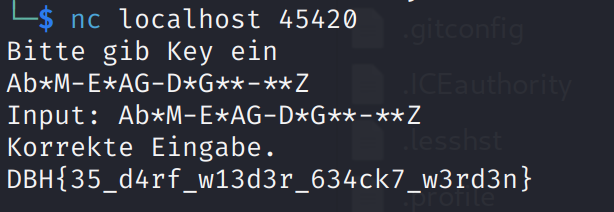

# rev-keychecker

## Lösungsvorschlag

Die Aufgabe ist eine Reversing-Challenge, deshalb wurde zur Analyse in diesem Write-Up Ghidra verwendet.

Ein naives Verbinden mit der Anwendung erwartet einen Key als Eingabe. Die Eingabe `Test` führt nicht zum Erfolg.

```text
$ nc 20.126.227.19 45420 
Bitte gib Key ein
Test
Input: Test

Falsche Eingabe.
```

Das Disassembly der main-Funktion in Ghidra ist:

```c
bool main(void)

{
  int iVar1;
  char local_28 [32];
  
  puts("Bitte gib Key ein");
  fgets(local_28,0x14,stdin);
  printf("Input: %s\n",local_28);
  iVar1 = check_key(local_28);
  if (iVar1 != 0) {
    puts("Korrekte Eingabe.");
    print_flag();
  }
  else {
    puts("Falsche Eingabe.");
  }
  return iVar1 == 0;
}
```

Die Funktion `print_flag()` wird nur aufgerufen, wenn der Input korrekt ist bzw. `check_key(char[])` einen Wert `!=0` zurück gibt.

Die Funktion, die in dieser Aufgabe von Interesse ist, ist die Funktion `check_key(char[])`:

```c

undefined8 check_key(char *param_1)

{
  undefined8 uVar1;
  
  if (param_1[4] == '-') {
    if (param_1[9] == '-') {
      if (param_1[0xf] == '-') {
        if (*param_1 == param_1[7]) {
          if (param_1[0xc] == param_1[8]) {
            if (param_1[3] == 'M') {
              if (param_1[0xc] == 'G') {
                if (param_1[0x12] == 'Z') {
                  if ((byte)(param_1[5] ^ param_1[10]) == 1) {
                    if ((byte)(param_1[1] ^ param_1[7]) == 0x23) {
                      uVar1 = 1;
                    }
                    else {
                      uVar1 = 0;
                    }
                  }
                  else {
                    uVar1 = 0;
                  }
                }
                else {
                  uVar1 = 0;
                }
              }
              else {
                uVar1 = 0;
              }
            }
            else {
              uVar1 = 0;
            }
          }
          else {
            uVar1 = 0;
          }
        }
        else {
          uVar1 = 0;
        }
      }
      else {
        uVar1 = 0;
      }
    }
    else {
      uVar1 = 0;
    }
  }
  else {
    uVar1 = 0;
  }
  return uVar1;
}
```

Die ersten drei Statemens erwarten einen Input, bei welchem das fünfte, zehnte und 17. Zeichen ein `-` ist.

```c
if (param_1[4] == '-')
if (param_1[9] == '-')
if (param_1[0xf] == '-')
```

Der Input sieht demnach wie folgt aus:

```
****-****-*****-***
```

Die nächsten beiden Bedingungen besagen, dass der erste und achte Buchstabe sowie der 13 und siebte Buchstabe gleich sein müssen.

```c
if (*param_1 == param_1[7])
if (param_1[0xc] == param_1[8])
```

Der eigentliche Buchstabe ist hier erstmal egal, weshalb der Buchstbae `A` verwendet wird.
```
A***-**AA-**A**-***
```
Nun erfolgt die Vorgabe für bestimmte Buchstaben an drei Stellen. Hier müssen ebenfalls die vorherigen Bedingungen beachtet werden.

```c
if (param_1[3] == 'M')
if (param_1[0xc] == 'G')
if (param_1[0x12] == 'Z')
```

Es ergibt sich folgender Key:
```
Ab*M-**AG-**G**-**Z
```
Die nächste Bedingung heißt vereinfacht in Prosa übersetzt: `Der Buchstabe an sechster Stelle und  der Buchstabe an elfter Stelle sind Nachbarn im Alphabet`

```c
if ((byte)(param_1[5] ^ param_1[10]) == 1) 
```
Dies führt zu folgendem Key:
```
A**M-E*AG-D*G**-**Z
```
Die letzte Bedingung ist basierend auf dem ASCII-Zeichensatz etwas komplexer. Der Wert an zweiter Stelle kann beliebig gewählt werden. In diesem Beispiel ist dies der Wert `A`. Für den achten Buchstaben ergibt sich dann der Wert : `"A" ^ 0x23 = 0x62 = "b"`

```c
if ((byte)(param_1[1] ^ param_1[7]) == 0x23)
```

Dies ergibt folgenden Input:
```
Ab*M-E*AG-D*G**-**Z
```

Diese Eingabe ist korrekt:
```
$ nc 20.126.227.19 45420
Bitte gib Key ein
Ab*M-E*AG-D*G**-**Z
Input: Ab*M-E*AG-D*G**-**Z
Korrekte Eingabe.
DBH{35_d4rf_w13d3r_634ck7_w3rd3n}
```
**Hinweis:** Wenn die Challenge lokal gehostet wird, so muss die Localhost-IP-Adresse `127.0.0.1` verwendet werden.



Natürlich gibt es hierfür mehr als nur eine korrekte Lösung bzw. Input.
Ein weiteres Beispiel für eine korrekte Eingabe:
```
AbCM-EDAG-DDGHK-ABZ
```


## Beseitigung der Schwachstelle
Da diese Aufgabe aus dem Bereich reversing ist, gibt es hier keinen Vorschlag zur Beseitigung einer Schwachstelle. Möchte man jedoch das Reversen schwieriger gestalten, so kann der Code bzw. das Assembly obfuskiert werden.

## Flag
```
DBH{35_d4rf_w13d3r_634ck7_w3rd3n}
```

## Basierend auf / Inspiriert von
Anwendungen, welche durch einen Keys bzw. Lizenzschlüssel aktiviert werden müssen (z. B. alte Computerspiele).