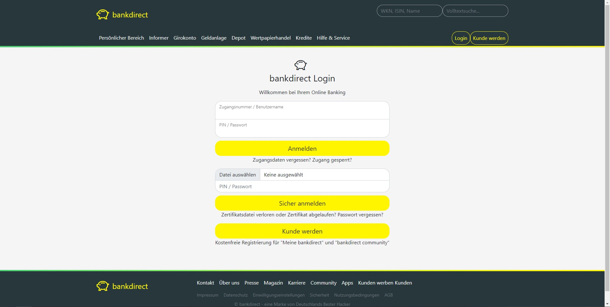
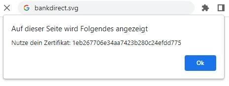
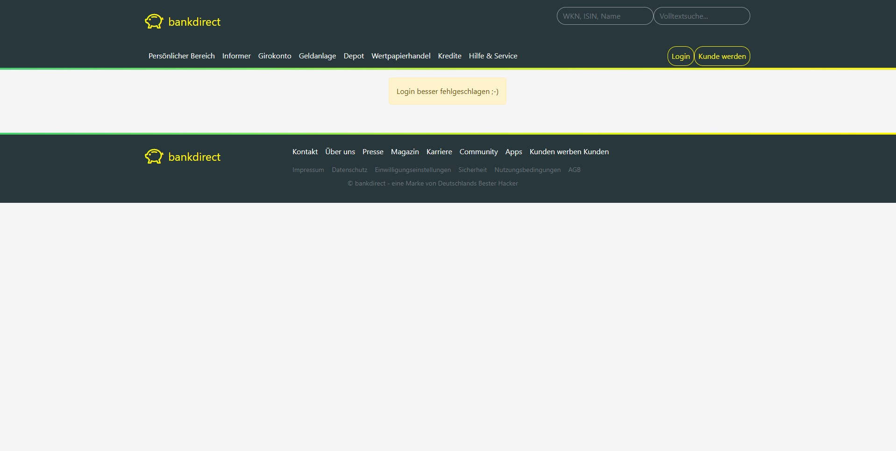
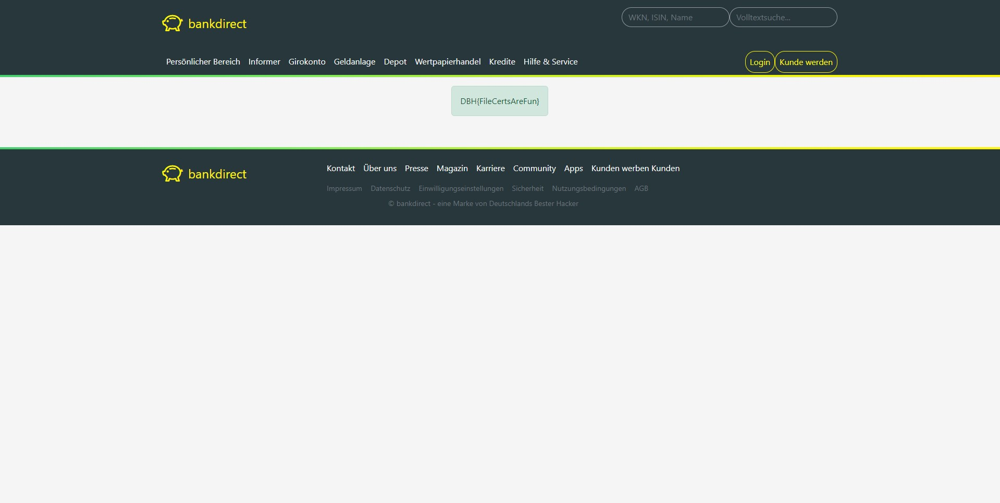

# web-bankdirect

## Lösungsvorschlag

Auf der Login-Seite der _bankdirect_ kann sich ein Kunde in seinen persönlichen Bereich einloggen.

> Hier anmelden für Ihr Online Banking: Girokonto, Depot und Wertpapiere. | bankdirect login



### Im Source Code

Im Quellcode wird an mehreren Stellen auf das Logo `bankdirect.svg` verwiesen:

```html
<link
	rel="apple-touch-icon"
	href="bankdirect.svg?size=180x180"
	sizes="180x180"
/>
<link
	rel="icon"
	href="bankdirect.svg?size=32x32"
	sizes="32x32"
	type="image/png"
/>
<link
	rel="icon"
	href="bankdirect.svg?size=16x16"
	sizes="16x16"
	type="image/png"
/>
<link rel="mask-icon" href="bankdirect.svg" color="#fff500" />
<link rel="icon" href="bankdirect.svg?color=#fff500" />
<link
	rel="preload"
	href="bankdirect.svg?color=#fff500&v=1657275786552"
	as="image"
	crossorigin
/>
```

Obwohl SVG keine Parameter zulässt, wurden hier Parameter übergeben. Das soll dazu führen, dass die Datei aufgerufen wird. In dem Fall wird das eingebettete JavaScript ausgeführt und man bekommt diesen Alert:



`1eb267706e34aa7423b280c24efdd775` ist der MD5-Hash von [dbh](https://md5.gromweb.com/?md5=1eb267706e34aa7423b280c24efdd775) und kann im Login-Vorgang mehrfach genutzt werden.

Im Quellcode lässt der File-Upload nur Dateien mit `.pfx`-Endung[^1] zu:

```html
<input
	id="floatingCert"
	type="file"
	name="loginCert"
	class="form-control"
	accept=".pfx"
/>
```

Ein Login-Vorgang über das Zertifikat gibt eine Rückmeldung aus, welche besagt, dass man auf dem richtigen Weg sei:



### In der robots.txt

Neben den Hinweisen im Quelltext und in den Bildern gibt es noch einen weiteren Hinweis in der `robots.txt`. Hier wird auf eine manifest.json Datei verwiesen.

```
// ...
Allow: /admin/admin.php

Manifest: manifest.json
Sitemap: index.php
```

### In der manifest.json

Die `manifest.json` enthält einen Eintrag, der im Standard[^2] nicht enthalten ist. Hier wird auf die Datei `.env` hingewiesen:

```json
{
	"short_name": "bankdirect",
	// ...
	"env": ".env"
}
```

Die Datei kann geladen werden und gibt weitere nützliche Hinweise auf vorhandene Dateien/Verzeichnisse wie Beispielsweise das `/certs/`-Verzeichnis im Webroot. Dort können die Einträge (invalid, dbh, md5) in den Platzhalter `\*` eingetragen werden und ergeben jeweils eine gültige Login-Datei:

```
curl 172.17.0.2/.env
bankdirect.svg
certs/*.pfx
  invalid
  dbh
  md5
```

## Erfolgreicher Login
Die Flag wird angezeigt, sofern sich auf einem der folgenden Wege angemeldet wird:

1. Der Dateiname ist `master.pfx` (Inhalt und andere Felder irrelevant)
2. Der Dateiinhalt ist `true` oder `dbh` (Dateiname und weitere Felder irrelevant)



## Beseitigung der Schwachstelle

Die Challenge `web-bankdirect` abzusichern benötigt mehrere Schritte. Zum einen darf eine svg-Datei keine sensiblen Informationen preisgeben. Werden zum Debuggen der Webanwendung testweise Ausgaben oder alerts hinzugefügt, müssen diese bei einem Code-Review oder dem go-live entfernt und bereinigt werden. Der Hinweis in der `robots.txt` auf die `manifest.json`-Datei war speziell für diese Aufgaben hinterlegt. Dass jedoch in einer manifest.json eine `.env` gefunden werden kann, ist leider des öfteren der Fall. Hier hätte ein sauberer Deployment-Prozess geholfen, sodass sensible Dateien nicht im Internet eingesehen werden können (als Prävention). Zur Sicherung sollten Dateien mit einem `.`-Präfix generell blockiert werden.
Zum anderen ist das System verwundbar, da nur die Bereitstellung einer `*.pfx`-Datei mit dem richtigen Namen bzw. Inhalt zum Ziel führt. Zertifikate müssen detailliert geprüft werden. Das reine Vorhandensein darf nicht zum Erfolg führen. Auch wenn kryptografische Implementierungen manchmal komplex sind, dürfen dadurch keine Schwachstellen entstehen.

## Flag
```
DBH{FileCertsAreFun}
```
## Footnotes

[^1]: vgl. pfx-Zertifikate wie bei ELSTER https://www.ssl.com/de/wie-man/Erstellen-Sie-mit-openssl-eine-pfx-p12-Zertifikatdatei/ \
[^2]: vgl. manifest.json https://developer.mozilla.org/docs/Mozilla/Add-ons/WebExtensions/manifest.json
