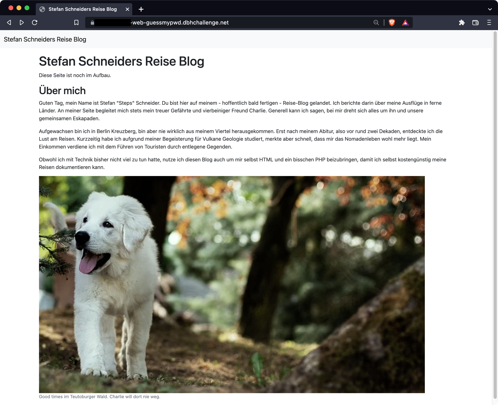
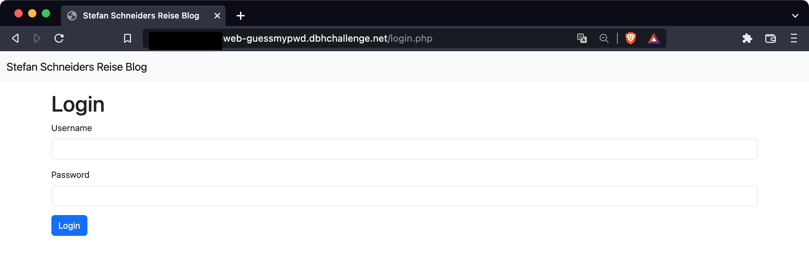
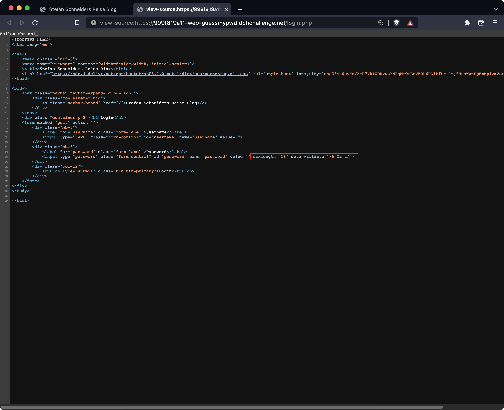
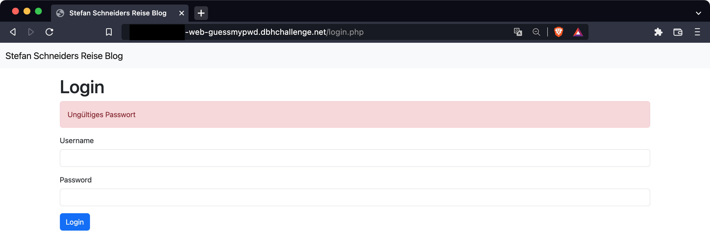
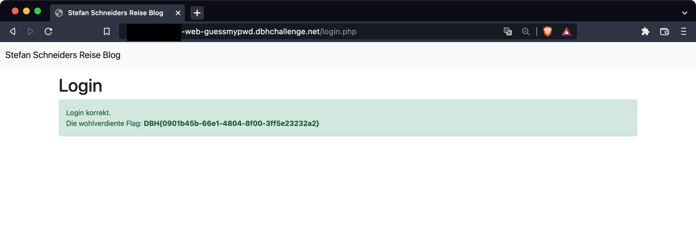

# web-guessmypwd

## Lösungsvorschlag

Die Webseite der Aufgabe ist recht einfach gehalten.
Es ist ein Reise Blog von Stefan Schneider mit ein paar Informationen zu der Person und seinen Interessen.



Unter dem Endpunkt `/login.php` ist eine Login-Form zu sehen.



Wird der Source-Code dieser Seite inspiziert, können Constraints erkannt werden, welche die Möglichkeiten der Eingaben deutlich reduzieren. Es ist nur eine maximale Länge von 18 Zeichen sowie die Eingabe von Buchstaben gestattet.



Auffällig ist, dass bei einem Login-Versuch mit Dummy-Daten die Meldung `Ungültiger Username` erscheint. Diese Information kann genutzt werden, um einen validen Usernamen zu ermitteln.


Basierend auf den Informationen des Reiseblogs ist hier eine Beispielliste an möglichen Usernamen:

```
Stefan
StefanS
Schneider
Steps
Charlie
stefan
stefans
schneider
schneiders
steps
charlie
```

Eine manuelle Prüfung ergibt, dass zwei Usernamen korrekt sind: `Steps` und `steps`



Anhand der Informationen aus der Webseite kann ebenfalls eine Passwort-Liste erstellt werden.
Diese basiert auf folgenden Worten:

```
Stefan
Steps
Schneider
Reise
Charlie
Berlin
Kreuzberg
Vulkane
Geologie
Teutoburger
Wald
```

Mittels des Skriptes `create_passwords.py` werden Passwörter erstellt, welche eine Länge von 18 Zeichen haben:

```
SchneiderSchneider
SchneiderKreuzberg
CharlieTeutoburger
KreuzbergSchneider
KreuzbergKreuzberg
VulkaneTeutoburger
TeutoburgerCharlie
TeutoburgerVulkane
```

Die Korrekten Credentials sind `Steps:TeutoburgerCharlie` bzw. `steps:TeutoburgerCharlie`.



## Beseitigung der Schwachstelle

Es gibt verschiedene Möglichkeiten die Sicherheit zu verbessern:

-   **Besseres Passwort:**
    Ein sicheres Passwort ist (pseudo-)zufällig generiert und hat eine Länge von mehr als 14 Zeichen. Der Blog-Besitzer hat in seinem Passwort Daten aus seinem Umfeld bzw. seinem Privatleben genutzt, welche öffentlich einsehbar sind. Dies sollte vermieden werden.
-   **Zwei-Faktor-Authentifizierung:**
    So kann selbst bei Verlust des Passworts bzw. nachdem ein Passwort erraten wurde kein erfolgreicher Login statt finden. Voraussetzung ist, dass der zweite Faktor sicher ist.
-   **Login-Form und dessen Ausgaben korrigieren:**
    Anhand der Ausgaben der Login-Seite konnten Teile der Credentials direkt geprüft werden.
    Solch ein Verhalten (gibt es zum Beispiel auch bei Office 365) sollte deaktiviert werden.
-   **Bruteforce-Attacken unterbinden:**
    Sobald eine Anzahl von Fehlversuchen von Logins auffallen, sollte der Login (zumindest temporär) gesperrt werden und der Administrator benachrichtigt werden.

Im Idealfall werden **alle** beschriebenen Maßnahmen umgesetzt.

## Flag
```
DBH{0901b45b-66e1-4804-8f00-3ff5e23232a2}
```

## Basierend auf / Inspiriert von

In der realen Welt gibt es genug Beispiele hierfür, zum Beispiel die Friseur-Webseite, deren Passwort "Föhn" ist.