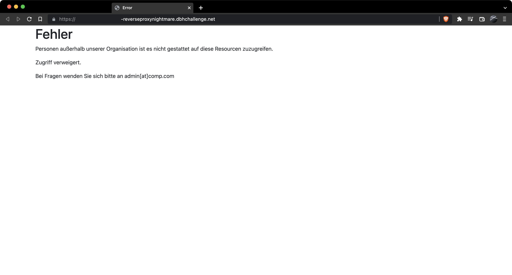
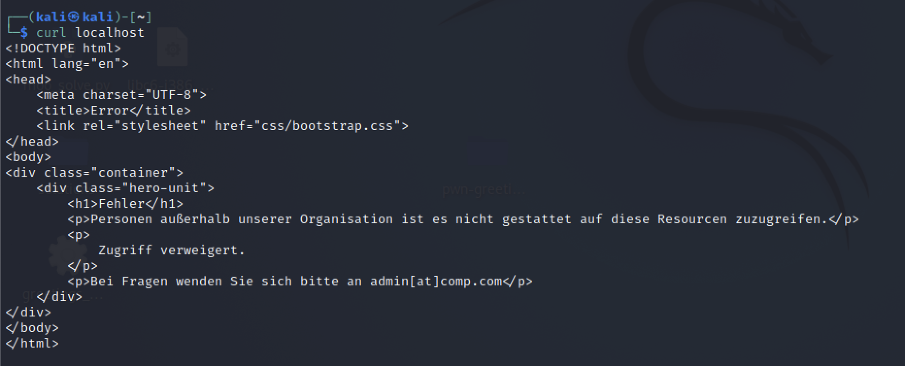
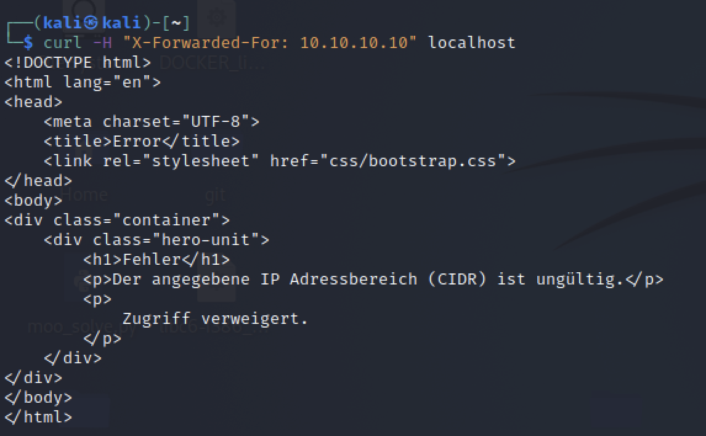
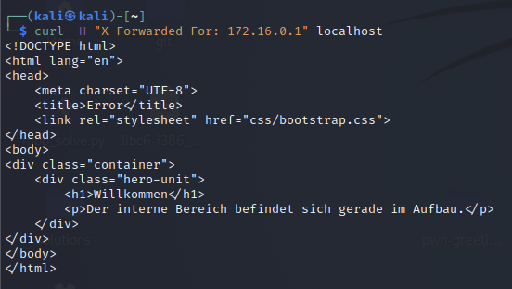
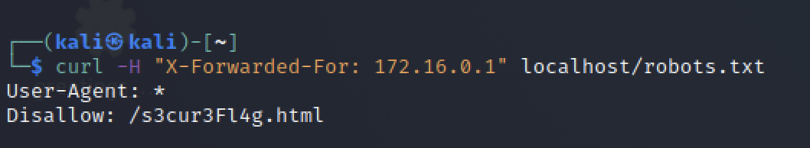
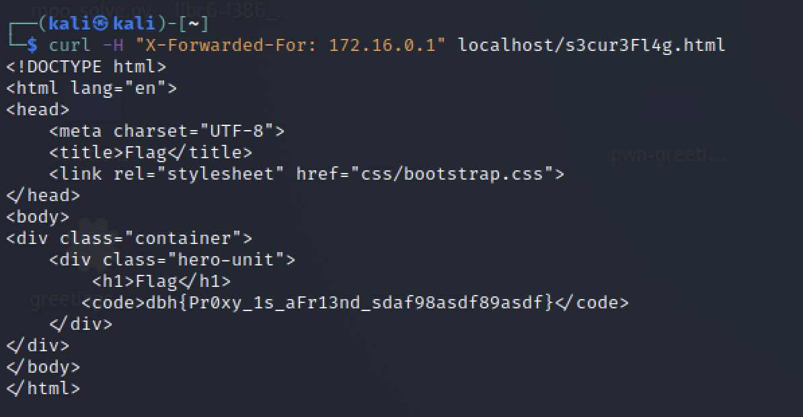

# web-reverseproxynightmare

## Lösungsvorschläge

Zuerst wird die Website nach Inhalten durchsucht. Außer einer Fehlermeldung, dass die Website für Benutzer außerhalb der Organisation nicht erreichbar ist, können keine weiteren hilfreichen Informationen ermittelt werden.



### Schwachstelle

Nach einer Analyse des HTTP-Traffics ist ein HTML-Header zu finden, welcher beim Hinzufügen die IP-Adresse des Requests ändert. Nach dem anfügen des `X-Forwarded-For` Headers zum GET Request ändert sich die Fehlermeldung wie folgt:



Somit ist klar, die Schwachstelle ist der `X-Forwarded-For` Header.

Im nächsten Schritt muss der richtige IP-Adressbereich ermittelt werden.

In der Challenge sind alle IP-Adressen im Bereich `172.16.0.0/12`, also `172.16.0.0–172.31.255.255` zulässig.
Die richtige IP-Adresse kann herausgefunden werden, indem die [privaten IP-Addressbereiche](https://en.wikipedia.org/wiki/Private_network) nachgeschlagen und ausprobiert werden.

Nachdem der richtige `X-Forwarded-For` Header gesetzt wurde, präsentiert die Challenge eine interne Landing Page.



### Gobuster / Dirbuster

Durch Enumerierung mit Tools oder manuell der `robots.txt`, kann der Name einer geheimen Seite `/s3cur3Fl4g.html` ermittelt werden.




Diese Seite beinhaltet die Flag.

## Flag
```
DBH{Pr0xy_1s_aFr13nd_sdaf98asdf89asdf}
```

## Beseitigung der Schwachstelle

Ein Client sollte niemals in der Lage sein mit Hilfe des `X-Forwarded-For` Headers die Client-IP des Anfragenden zu überschreiben. Die Technik ist nützlich um die "echte" oder "originale" Client-IP des Aufrufenden auch über Proxy-Server hinweg mitzusenden.

Um einen Missbrauch zu verhindern muss die Source-IP (z.B. die des Proxyservers) in einer Whitelist aufgeführt sein und es darf nur der letzte an den Request angefügte `X-Forwarded-For` Header gewertet werden.

Ein Beispiel für eine Konfiguration mit NGINX: https://stackoverflow.com/questions/66692200/nginx-check-if-cloudflare-forward-or-direct-ip-and-limit-accordingly/66809489#66809489