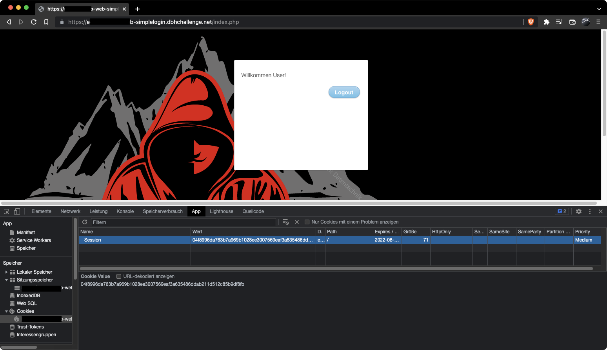
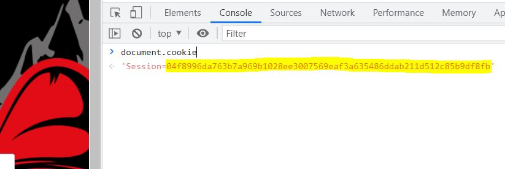
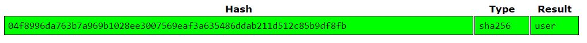
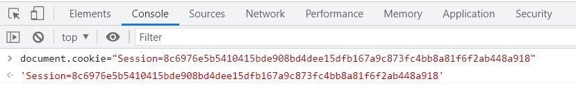
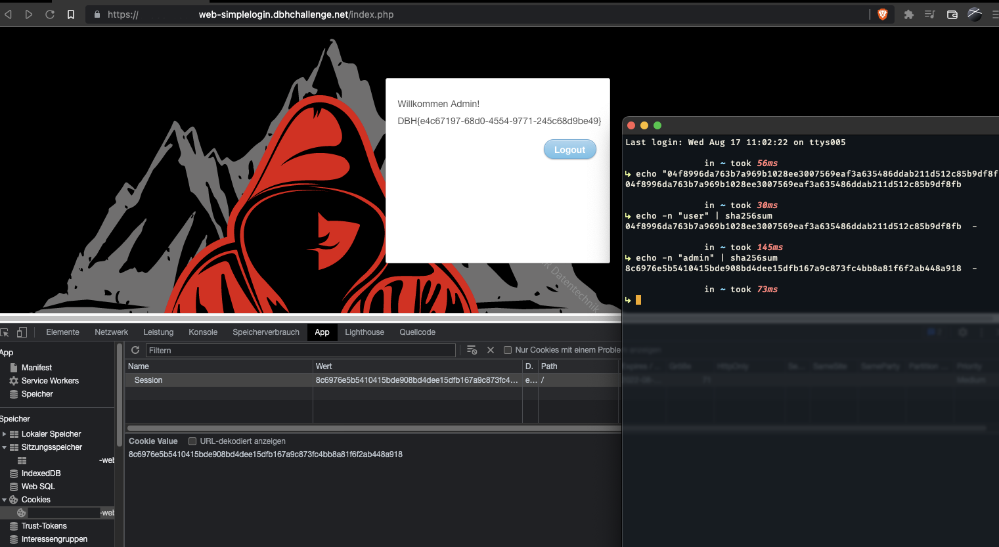

# web-simplelogin

## Aufgabe
Es soll sich als Benutzer `admin` angemeldet werden.

### Gegeben

Es ist ein Benutzername und ein Passwort für einen einfachen Benutzeraccount `user`)angegeben.

user:f45mSC4B5yZRzpoTE9

### Lösungsvorschlag

Da ein Account angeben ist, sollte dieser als erstes etwas genauer inspiziert werden. 
Hierfür kann sich mit den Credentials erfolgreich an der Webseite  angemeldet werden. Anschließend können die Cookies analysiert werden. Es kann ein Cookie mit dem Namen `Session` erkannt werden, welcher augenscheinlich mit einem Hashwert gesetzt ist.




Da das Bruteforcen von Hashwerten viel Zeit in Anspruch nehmen kann, sollte zuerst online geprüft werden, ob dieser Hash bereits zurückgerechnet wurde. Hierfür bietet sich zum Beispiel [Crackstation](https://crackstation.net/) an. Folgende Informationen können über Crackstation erlangt werden:



Diese Ausgabe gibt zwei Informationen preis. Zum einen handelt es sich bei dem Hash um einen SHA256-Hashwert.
Zum anderen wird der Benutzername als Hash im Cookie verwendet. 
Hieraus lässt sich schließen, dass der Benutzername `admin` mithilfe von SHA256 gehasht und anschließend als Cookie eingesetzt werden muss.

Nachdem man manuell den Sha256-Wert `8c6976e5b5410415bde908bd4dee15dfb167a9c873fc4bb8a81f6f2ab448a918` für `admin` berechnet hat,kann man diesen als Wert für den `Session`-Cookie einsetzen (hier via Console) und die Seite neu laden.



Nun ist der Benutzer `admin` angemeldet und die Flag wird angezeigt.



## Beseitigung der Schwachstelle

Es sollten niemals Benutzernamen oder ähnliches für Session Cookies genutzt werden. Ein Session Cookie sollte ein zufällig generierter Wert sein, welcher auf dem Backend erzeugt wird.

## Flag
```
DBH{e4c67197-68d0-4554-9771-245c68d9be49}
```
