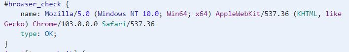
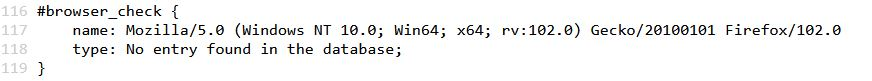
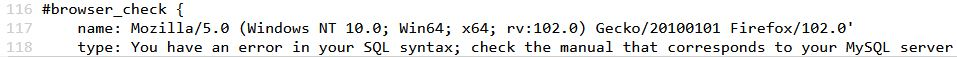
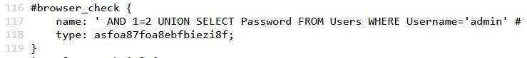

# web-simplelogin02

## Aufgabe

Es muss sich als Benutzer `admin` angemeldet werden.

### Gegeben

Es ist lediglich die Homepage gegeben.

### Lösungsvorschlag

Da keine weiteren Informationen vorhanden sind, sollte zuerst der HTML-Code analysiert werden. Auffällig ist hierbei, dass im Header in den `Style` Informationen, eine Abfrage des genutzten Browsers erfolgt.



Im diesem Fall handelt wurde ein Chrome Browser verwendet und der Wert `OK` zurück gegeben. 
Wird die Homepage mit einem Firefox Browser geöffnet, ergibt sich der Wert `No entry found in the database`:




Anscheinend wird auf dem Backend der übertragene Browser-Typ mit einer Datenbank abgeglichen. 
Zum Testen, ob eine SQL Injection Schwachstelle vorliegt, kann ein Hochkomma `'` an den Namen des Browsers angehängt werden.



Der Fehler zeigt an, dass eine SQL Injection Schwachstelle vorliegt. Mittels einer User-Eingabe kann das SQL-Statement manipuliert werden.
Durch Ausführen einer manuellen SQL Injection - das Ändern des `User-Agent`-Headers mittels eines [Browser-Addons](https://addons.mozilla.org/de/firefox/addon/modify-header-value/) zu `' AND 1=2 UNION SELECT Password FROM Users WHERE Username='admin' #` - erlangt man das Passwort `asfoa87foa8ebfbiezi8f` des Benutzers `admin` aus der Tabelle `Users`:



Mit diesem Passwort kann man sich nun anmelden und erhält die Flag.


## Beseitigung der Schwachstelle

Im Backend wird folgender PHP Code ausgeführt:

```PHP
<?php
#Fehlerausgabe aktivieren
error_reporting(E_ALL);

#Mit der Datenbank verbinden
$db = new mysqli('localhost', *username*, *password*, *databasename*);

#Fehlermeldung ausgeben, falls ein Fehler aufgetreten ist
print_r ($db->connect_error);

#Ausgebe des Browser-Typs
echo "name: " . $_SERVER['HTTP_USER_AGENT'] . "\n	type: ";

#Abfrage in der Datenbank
$erg = $db->query("SELECT Status FROM Browser Where Type='" . $_SERVER['HTTP_USER_AGENT'] . "'");

#Fehlermeldung ausgeben, falls ein Fehler aufgetreten ist
print_r ($db->error);

#Fehlerausgabe deaktivieren
error_reporting(0);

#Ausgabe des Wertes aus der Datenbank oder Fehlermeldung
if ($erg->num_rows == 0){
	echo "No entry found in the database";
}else{
	$datensatz = $erg->fetch_assoc();
	echo $datensatz['Status'];
}

#Datenbankverbindung schließen
$erg->free();
$db->close();
?>;
```

Problematisch ist hierbei diese Stelle im Code:

```PHP
$erg = $db->query("SELECT Status FROM Browser Where Type='" . $_SERVER['HTTP_USER_AGENT'] . "'");
```

Hierbei wird der Browser Typ direkt als String in die SQL-Abfrage eingefügt. Dies ermöglicht es einem Angreifer, seinen eigenen Code einzuschleusen.

Abfragen sollten immer nur dann erfolgen, wenn der übergebene String geprüft, unsichere Zeichen [entfernt](https://www.php.net/manual/de/function.mysql-real-escape-string.php) wurden und sichergestellt ist, dass die Eingabe nur als String und nicht als Code interpretiert wird.

Hierfür kann man zum Beispiel sogenannte [Prepared Statements](https://www.php.net/manual/de/pdo.prepared-statements.php) verwenden.

Zusätzlich sollten Passwörter niemals in Klartext gespeichert werden.
Eine Möglichkeit ist diese zu [salzen](https://de.wikipedia.org/wiki/Salt_(Kryptologie)) und anschließend den Hashwert des gesalzenen Passwortes zu speichern.

## Flag
```
DBH{94b711b-0dcb-40e7-8b42-25e4b9668ae6}
```
