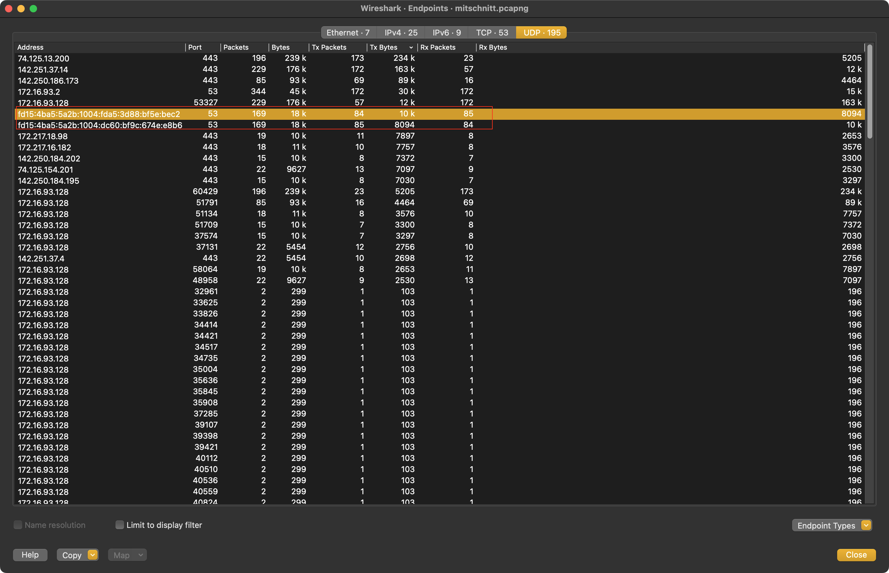
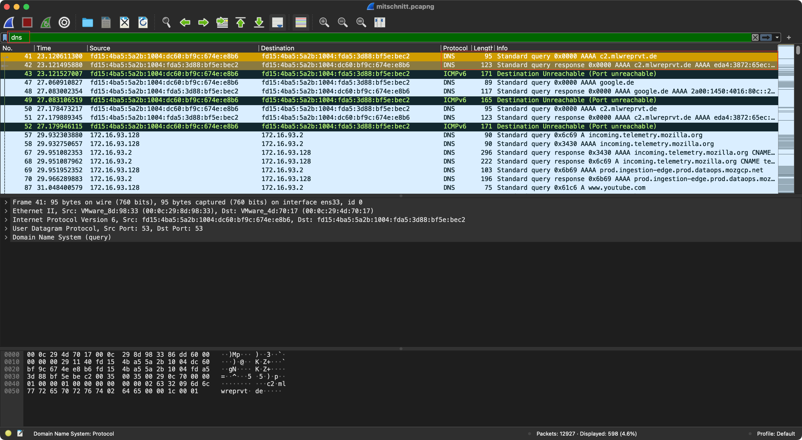
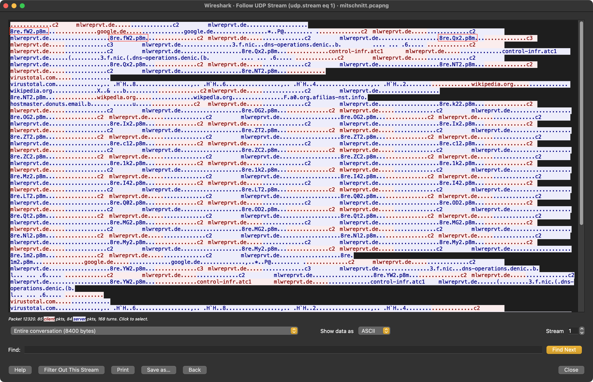

# forensiscs-pcap

## Lösungsvorschlag

Die Datei entspricht den Angaben und ist eine pcapng-Datei.

```console
$ file mitschnitt.pcapng
mitschnitt.pcapng: pcapng capture file - version 1.0
$ shasum -a 256 mitschnitt.pcapng
45b938e106b4bed1e7b2b7b5e454c8dc513a21ca0acfba3ba0c25ef9ec648022  mitschnitt.pcapng
```

Eine Erstanalyse des Traffics erfolgt mittels Wireshark.

Bei der UDP Endpunktstatistik fallen zwei Endpunkte im IP-Adressformat IPv6 auf.
Die Kommunikation der Endpunkte erfolgt über den Port 53.



Bei Anwendung des Wireshark-Filters `dns` fallen AAA-Records mit dem DNS-Namen `c2.mlwreprvt.de` auf.



Werden die UDP-Pakete der Ströme inspiziert, fällt auf, dass die Antworten zu Anfragen auf `c2.mlwreprvt.de` unterschiedlich ausfallen. Hier wurde DNS als `covert channel` verwendet, um die Flag zu übertragen.



Das Extrahieren der jeweiligen Bytes aus den Anfragen kann mit dem Skript `solve.py` durchgeführt werden.
Hierbei erfolgt die Rekonstruktion der Flag mehrstufig.

Das unbedachte Extrahieren einzelner Buchstaben aus den DNS-Antworten liefert den folgenden String:

```
fWfWQxQxQxNTNTNTk2OGOGOGIxIxZTZTZTc1c1ZCZCZC1k1k1kMzI4I4I4LTLTQ0Q0ODODQtQtMGMGMGNlNlMyMyMy1m1mYWYWYWVhVhVhOWOWOWM4M4ZnZnZntItItIQkQkQkQ=Q=fWfW
```

Bei der Analyse fallen folgende Punkte auf:
* Die übermittelte Flag scheint codiert zu sein,
* die Übermittlung enthält Duplikate,
* bei Erreichen des Endes der Übertragung wird die Flag erneut übermittelt.

Nach Bereinigung der Duplikate ergibt sich der folgende String:

```
fWQxNTk2OGIxZTc1ZC1kMzI4LTQ0ODQtMGNlMy1mYWVhOWM4ZntIQkQ=
```

Eine Base64-Dekodierung des Strings ergibt die folgende Zeichenkette:

```
}d15968b1e75d-d328-4484-0ce3-faea9c8f{HBD
```

Wird der String umgekehrt erhält man die Flag:

```text
DBH{f8c9aeaf-3ec0-4844-823d-d57e1b86951d}
```

## Beseitigung der Schwachstelle

Da diese Aufgabe aus dem Bereich der Forensik stammt, gibt es hier keinen Vorschlag zur Beseitigung der Schwachstelle.

## Flag
```
DBH{f8c9aeaf-3ec0-4844-823d-d57e1b86951d}
```
## Basierend auf / Inspiriert von

Der Hinweis lautet `Bachosens, DNS`. Nach einer Recherche kann hierzu zum Beispiel ein Artikel von Jon DiMaggio auf medium.com [1] gefunden werden. Dort wird beschrieben, dass im Kontext der Malware Bachosens beobachtet wurde, wie DNS-Requests für AAA-Records zum Übertragen von Daten genutzt wurden.

[1]: medium.com [https://medium.com/threat-intel/cybercrime-investigation-insights-bachosens-e1d6312f6b3a](https://medium.com/threat-intel/cybercrime-investigation-insights-bachosens-e1d6312f6b3a)
