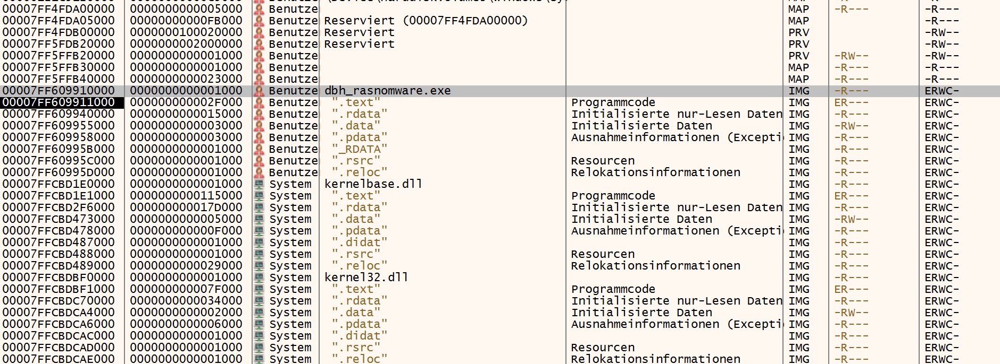
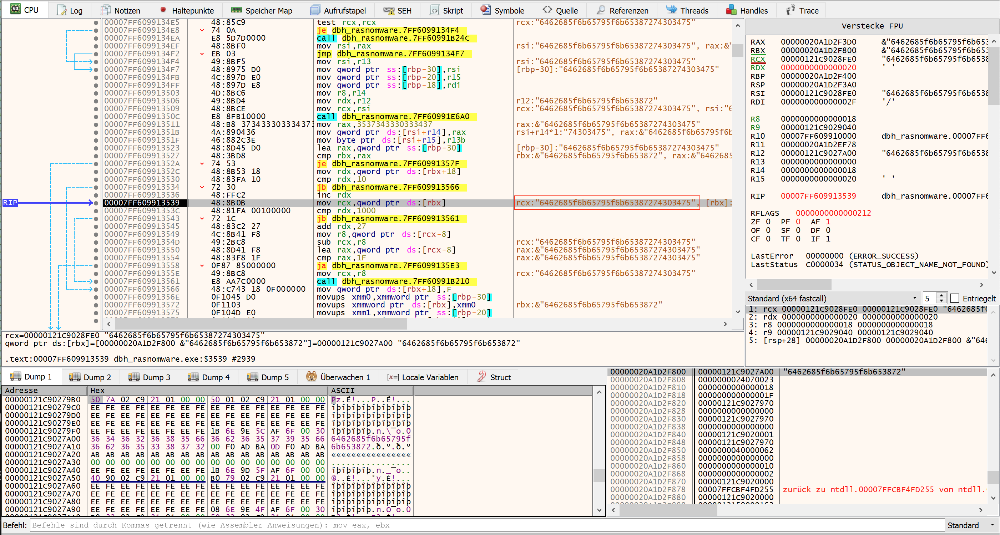
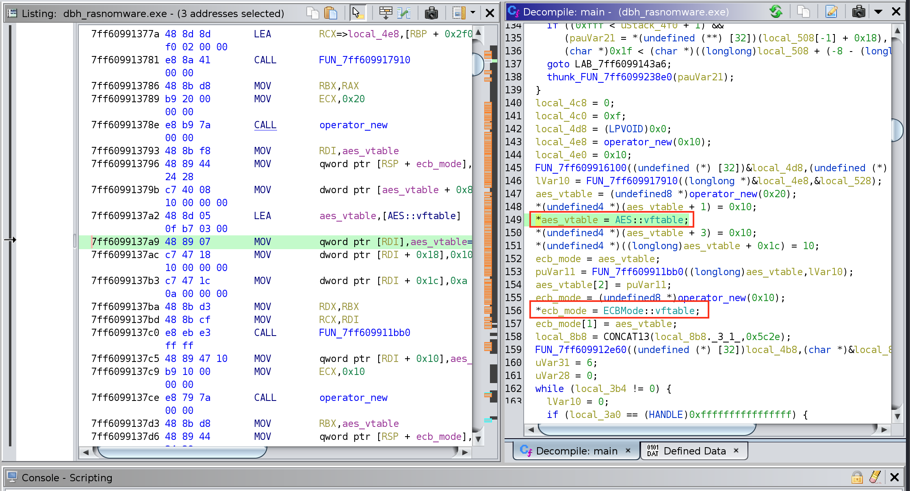
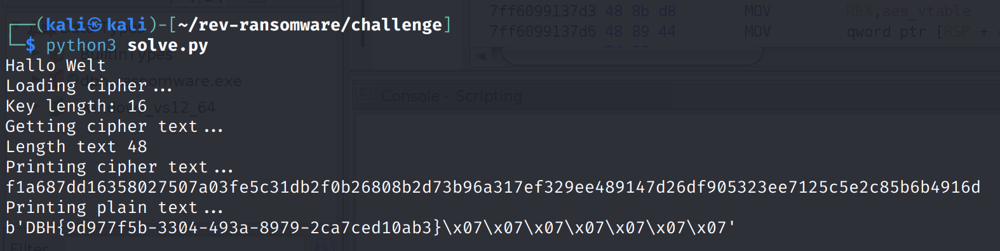

# rev-ransomware

## Aufgabe

Es soll die Datei `flag.txt.dbh` entschlüsselt werden.

### Gegeben

Die Anwendung `dbh_ransomware.exe` und die Datei `flag.txt.dbh` sind bei dieser Aufgabe gegeben. Das Programm `dbh_ransomware.exe` verschlüsselt alle Dateien innerhalb eines Ordners sobald es ausgeführt wird.

### Lösungsvorschlag

Zur Analyse des Programms kann zum Beispiel die Disassembler [IDA](https://hex-rays.com/) und [Ghidra](https://ghidra-sre.org/) und der Debugger [x86dbg](https://github.com/x64dbg/x64dbg) verwendet. 
Die Main-Funktion wird von IDA automatisch erkannt und startet bei 
`0x0000000140003600`.

**Hinweis:** Im Kombination mit dem Debugging wurde beim Disassembling rebased. D.h. die Basis-Adresse ist nun  `0x00007FF609910000`.



Wird das Programm Schritt für Schritt mit dem Debugger analysiert, kann zu Beginn der Main-Methode ein Funktionsaufruf identifiziert werden.
Innerhalb dieser aufgerufenen Funktion wird der Schlüssel erstellt. Sobald dieser erstellt wurde, kann er aus dem Speicher ausgelesen werden:



Der Schlüssel besteht aus Hex Werten und lautet:

```
6462685f6b65795f6b65387274303475
```

Wird der Hex Schlüssel als String dekodiert erhält man folgenden Wert:

```
dbh_key_ke8rt04u
```

Durch eine weitere Analyse des Codes kann erkannt werden, dass zur Verschlüsselung AES-ECB verwendet wurde.



Anschließend kann die Datei mit dem Schlüssel und dem entsprechenden Verschlüsselungsverfahren entschlüsselt werden. Hierfür kann frei verfügbare Software verwendet oder auf ein selbst geschriebenes Skript zurückgegriffen werden.

Hier ein Beispiel für ein Python Script `solve.py`, welches die Datei entschlüsselt und die Flag ausgibt:

```Python
from Cryptodome.Cipher import AES
#From: ttps://stackoverflow.com/questions/70705404/systemerror-py-ssize-t-clean-macro-must-be-defined-for-formats

#16 Bytes means AES-128
KEY = "dbh_key_ke8rt04u"
BLOCK_SIZE_BYTES = 16
PATH_ENCRYPTED_FILE = "./flag.txt.dbh"


def get_cipher_text():
	print("Getting cipher text...")
	file = open(PATH_ENCRYPTED_FILE,mode='rb')
	# read all lines at once
	all_of_it = file.read()
	# close the file
	file.close()

	return all_of_it#.encode("utf8")

def main():
	print("Loading cipher...")
	print("Key length: %d" % len(KEY))
	decipher = AES.new(KEY.encode("utf8"), AES.MODE_ECB)
	cipher_text = get_cipher_text()
	print("Length text %d " % len(cipher_text))
	print("Printing cipher text...")
	print(cipher_text.hex())
	print("Printing plain text...")
	print(decipher.decrypt(cipher_text))

if __name__ == '__main__':
	main()

```



## Beseitigung der Schwachstelle

Schlüssel sollten für jeden Anwendungsfall neu und zufällig generiert werden und nicht hart codiert im Programm stehen.

## Flag
```
DBH{9d977f5b-3304-493a-8979-2ca7ced10ab3}
```
